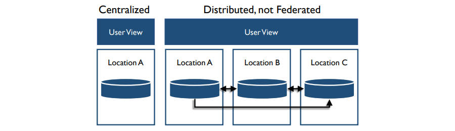
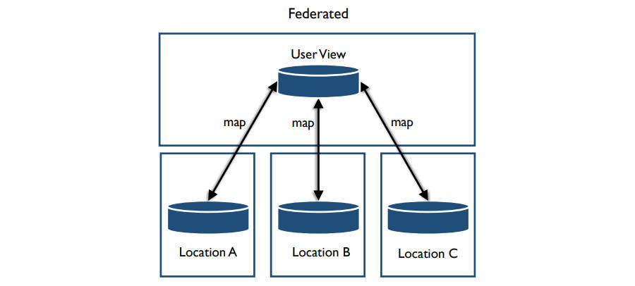
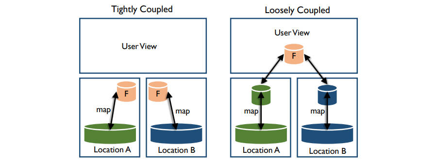

# 数据存储和操作相关概念

- 数据存储和操作包括对存储数据的设计、实施和支持，以在其从创建/获取（creation/acquisition）到处置（disposal）的整个生命周期中最大化其价值
- 数据存储和操作包括两个子活动
  - 数据库支持
    - 侧重于与数据生命周期相关的活动，从数据库环境的初始实施、到获取、备份和清除数据（obtaining, backing up, and purging dat），也包括确认数据库运行良好，监控和调整（Monitoring and tuning）对于数据库支持至关重要
  - 数据库技术支持
    - 包括定义满足组织需求的技术要求、定义技术架构、安装和管理技术以及解决与技术相关的问题

## 数据存储和操作的驱动因素

- 公司依靠其信息系统运行业务，数据存储和操作活动队伍依赖数据的组织至关重要，业务连续性是这些活动的主要驱动力，如果系统不可用，公司运营可能会受到影响或完全停止，用于IT运营的可靠数据存储基础设施（infrastructure）可以最大限度地降低中断风险（the risk of disruption）

## 数据存储和操作的目标

- 在整个数据生命周期中管理数据的可用性
- 确保数据资产的完整性
- 管理数据事务的性能

## 数据存储和操作的原则

- 识别自动化机会并采取行动（Identify and act on automation opportunities）
  - 自动化数据库开发过程、开发工具和流程，缩短每个开发周期，减少错误和返工，并最大限度地减少对开发团队的影响
  - 通过自动化，数据库管理员可以适应对应用程序开发的更多迭代（敏捷）方法，自动化应与数据建模和数据架构协作完成
- 在构建时考虑重用（Build with reuse in mind）
  - 开发和促进对抽象和可重用数据对象的使用，以防止应用程序域数据库模式紧密耦合（即对象关系阻抗不匹配（object-relational impedance mismatch））
  - 可以使用数据库视图、触发器、函数和存储过程、应用程序数据对象和数据访问层、XML和XSLT、ADO.NET类型数据集以及Web服务
  - 数据库管理员应能够评估虚拟化数据的最佳方法，最终目标是能够尽可能快速、简单、轻松地使用数据库
- 理解并且恰当地应用最佳实践（Understand and appropriately apply best practices）
  - 数据库管理员应遵循数据库标准和最佳实践，但如果给出可接受的原因，也可以灵活地（flexible ）偏离（deviate），数据库标准永远不应成为项目成功的威胁
- 连接数据库标准以支持需求（Connect database standards to support requirements）
  - 如服务水平协议（SLA，Service Level Agreement）可以反映数据库管理员推荐和开发人员接受的确保数据完整性和安全性的方法，如果开发团队将编写自己的数据库更新流程或数据访问层，则服务水平协议应反映责任从数据库管理员转移到开发团队，这样可防止对标准采取“all or nothing”的方法
- 设定对数据管理员角色在项目工作中的期望（Set expectations for the DBA role in project work）
  - 在项目定义阶段让数据库管理员参与其中（onboard）可以帮助整个系统开发生命周期（SDLC），数据管理员可以预先（up-front）了解项目需求和支持需求，这将阐明项目团队对数据组的期望，并因此改善沟通
  - 在分析和设计期间拥有专门的（dedicated）主要和次要数据管理员明确了对数据管理员任务、标准、工作效果（work effort）和时间线，团队还应明确实施后对支持的期望

## 数据库术语（Database Terms）

- 数据库（Database）
  - 任何存储数据的集合，无论其结构或内容如何，一些大型数据库有实例和模式
- 实例（Instance）
  - 通过数据库软件对一个特定存储区域的访问控制，一个组织通常由多个实例同时执行，使用不同的促成你区域，每个实例都独立（independent）于其他实例
- 模式（Schema）
  - 数据库或实例中包含的数据库对象的子集，模式用于将对象组织成更可管理的的部分，通常一个模式有一个所有者和一个特定于访问内容的访问列表
  - 模式的常见用途是将包含敏感（sensitive）数据的对象与一般用户进行隔离（isolate），或将只读视图与关系数据库中的基础表进行隔离，模式也可用来指代具有共同点的数据库结构的集合
- 节点（Node）
  - 作为分布式（distributed）数据库的一部分托管处理或数据的单个（individual）计算机
- 数据库抽象（Database abstraction）
  - 用于调用数据库函数的通用应用程序接口（API），借此应用程序可以连接到多个不同的数据库，而程序员不需指导所有可能的数据库的所有函数调用
  - 开放式数据库连接（ODBC，）是支持数据库抽象的API示例，优点是可移植性（portability），缺点是无法使用不通用的特定数据库功能

## 数据生命周期管理（Data Lifecycle Management）

- 数据库管理员通过设计、实施和使用存储、处理或检索数据的任何系统来维护和确保数据在其整个生命周期内的准确性和一致性，数据库管理员是所有数据库更改的监管人（custodian），许多方面可能会请求更改，数据库管理员确定要对数据库进行的精确更改，并实施更改和控制更改
- 数据生命周期管理包括实施数据获取（acquisition）、迁移（migration）、保留（retention）、到期（expiration）和处置（disposition）的策略和流程，谨慎的（prudent）做法是准备检查表（checklists）以确保所有任务都高质量执行，数据库管理员应使用受控的、有记录的和可审核的过程将应用程序数据库移动更改为质量保证或认证和生产环境（Quality Assurance or Certification (QA) and Production environments）

## 管理员（Administrators）

- 数据库管理员是数据存储和操作中的主导（dominant）角色，是数据安全、数据建模的物理方面和数据库设计中的关键（critical）角色，数据库管理员为开发、测试、QA和特殊用途的数据库环境提供支持
- 数据库管理员不是执行数据存储和操作活动的唯一角色，数据专员、数据架构师、网络管理员、数据分析师和安全分析师参与性能、保留和恢复的规划，这些团队可参与来自外部源（external sources）的数据获取和数据处理
- 很多数据库管理员专门担任生产、应用程序、过程和开发数据库管理员，一些组织有网络存储管理员（NSA，Network Storage Administrators），专门负责支持与数据存储应用程序或结构分开的数据存储系统，某些组织中每个专门角色向IT内的不同组织报告，生产数据库管理员属于生产基础设施或应用程序操作支持组，应用程序、开发和过程数据库管理员属于应用程序开发组织，网络存储管理员属于基础设施组织

### 生产数据库管理员（Production DBA）

- 生产数据库管理员主要负责数据操作管理
  - 通过性能调整、监控、错误报告和其他活动确保数据库的性能和可靠性
  - 实施备份和恢复机制以确保数据在任何境遇（circumstance）下丢失都可以恢复
  - 如果需要持续可用的数据，则实施数据库的集群（clustering）和故障转移（failover）机制
  - 进行其他数据库维护活动，如实施数据归档（archiving）机制
- 生产数据库管理员的交付成果
  - 生产数据库环境，包括支持服务器（supporting server）上的数据库管理系统（DBMS）实例，其具有充足的（sufficient）大小和容量以确保足够的（adequate）性能，并针对适当级别的安全性、可靠性和可用性进行配置
  - 生产环境中数据库更改的受控实施机制和流程
  - 确保数据的可用性、完整性和可恢复性以应对所有可能导致数据丢失或损坏（corruption）的机制
  - 检测（detect）和报告数据库、数据库管理系统或数据服务器中发生的任何错误的机制
  - 数据库可用性、恢复和性能（availability, recovery, and performance）符合服务级别协议
  - 在工作负载和数据量变化（workloads and data volumes vary）时监控数据库性能的机制和流程

### 应用程序数据库管理员（Application DBA）

- 应用程序数据库管理员负责所有环境（开发/测试、QA和生产）中的一个或多个数据库，而不是任何这些环境的数据库管理系统
- 有时应用程序数据库管理员向负责开发和维护其数据库所支持的应用程序的组织单位报告，设置应用程序数据库管理员有利有弊（pros and cons）
- 应用程序数据库管理员专注于特定的数据库，可用为应用程序开发人员提供更好地服务，但应用程序数据库管理员容易变得孤立（isolated）并且看不到组织的整体数据需求和常见的数据库管理员实践
- 应用程序数据库管理员与数据分析师、建模师和架构师密切合作

### 过程和开发数据库管理员（Procedural and Development DBAs）

- 过程数据库管理员领导对过程数据库对象（procedural database objects）的审查和管理，过程数据库管理员专门负责开发和支持由DBMS控制和执行的过程逻辑：存储过程、触发器和用户自定义函数，过程数据库管理员确保此过程逻辑得到计划、实施、测试和共享（重用）
- 开发数据库管理员专注于数据设计活动，包括创建和管理特殊用途数据库，如沙盒（sandbox）或探索区域（exploration areas）
- 很多情况下两个功能可以合并到一个位置下

### 网络存储管理员（NSA）

- 网络存储管理员关注支持数据库存储阵列（storage arrays）的硬件和软件，多个网络存储阵列系统与简单的数据库系统有不同的需求和监控要求

## 数据库架构类型（ Database Architecture Types）

- 数据库分为集中式（centralized）和分布式（distributed），集中式系统管理单个数据库，分布式系统管理多个系统上的多个数据库，分布式系统的组件可以柑橘组件系统的自治性（autonomy）分为联邦（federated）和非联邦（non-federated），也称为自治（autonomous）和非自治（non-autonomous）

### 集中式数据库（Centralized Databases）

- 集中式数据库将一个系统的所有数据集中在一处，所有用户都来到同一个系统访问数据，对于某些受限的（restricted）数据，集中式可能是理想的，但对于需要广泛可用的数据，集中式数据库存在风险，如集中式系统不可用时，则没有其他方法可以访问数据

### 分布式数据库（Distributed Databases）

- 分布式数据库使快速访问大量节点上的数据称为可能，数据库管理软件在服务器之间复制数据，从而在计算机集群上提供高可用服务，数据库管理软件还可检测和处理故障
- 一些分布式数据库使用MapReduce计算模式（computational paradigm）以进一步提高性能，在MapReduce中，数据请求被分为很多小的工作片段（），每个工作片段可以在集群的任何节点上执行或重新执行，此外数据在计算节点是同地协作的（co-located），从而提供非常高的聚合带宽（bandwidth），文件系统和应用程序都设计为自动处理节点故障

#### 联邦数据库（Federated Databases）

- 数据联邦（federation）提供数据而不需要对源数据（source data）进行额外的持久化（persistence）或复制（duplication）
- 联邦数据库系统将多个自治数据库系统映射到单个联邦数据库中，这些构成的（constituent）数据库有时在地理上是分开的，通过计算机网络相互连接，其保持自治，但参与联邦以允许部分或受控地共享其数据
- 数据联邦不是实际的数据集成，而是通过数据互操作性将联邦数据库的视图作为一个大对象来管理
- 非联邦数据库系统是非自治的数据库管理系统的集成，其由集中式数据库管理系统控制、管理和治理
- 联邦数据库最适用于企业信息集成、数据虚拟化、模式匹配和主数据管理等异构和分布式集成项目（heterogeneous and distributed integration projects）

- 联邦结构取决于组件数据库系统的集成级别和联邦提供的服务范围，联邦数据库管理系统分为松耦合或紧耦合（loosely or tightly coupled）
  - 松耦合系统的多个组件数据库构建其自己的联邦模式，用户使用多种数据库语言来访问各个组件数据库系统，但这消除了任何级别的位置透明性（location transparency），迫使用户直接了解联邦模式，用户从其他组件数据库导入所需的数据，并将其与自己的数据库集成以形成联邦模式
  - 紧耦合系统的组件系统使用独立的流程来构建和发布集成的联邦模式，相同的模式可以应用于联邦的所有部分，不需要数据复制

#### 区块链数据库（Blockchain Database）

- 区块链数据库是一种用于安全地管理金融交易的联邦数据库，其也可以用于合同管理或监控信息交换
- 区块链数据库包括两种类型的结构：单个记录（individual records）和块（blocks），每个交易有一条记录，数据库创建有时间限制的交易组（区块）链，交易组（区块）中包括链中前一个区块的信息，新生成的区块位于链的末端，通过哈希算法生产存储在区块中的交易信息，一旦新块被创建，旧块的哈希值就永远不再改变，这意味着块中包含的任何交易都不会改变，如果交易或块被更改则哈希值不再匹配

#### 虚拟化/云平台（Virtualization / Cloud Platforms）

- 虚拟化（也被称为云计算）在不需要最终用户了解提供服务的系统的物理位置和配置的情况下提供计算、软件、数据访问和存储服务
- 虚拟化可以是本地的（on-premises）或外部的（off-premises）
  - On-premises software is installed and runs on computers on the premises of the person or organization using the software, rather than at a remote facility such as a server farm or cloud.
- 云计算是广泛采用虚拟化、面向服务架构以及效用计算（utility computing）的自然演变（natural evolution）
- 在云上实现数据库的方法
  - 虚拟机镜像（Virtual machine image）
    - 云平台允许用户购买有时间限制的虚拟机实例，可在这些虚拟机上运行数据库，用户可以上传安装了数据库的虚拟机镜像，也可以使用包含优化安装的数据库的现成虚拟机镜像
  - 数据即服务（DaaS，Database-as-a-service）
    - 一些云平台提供使用Daas的选项，无需为数据库物理启动虚拟机实例，由数据库服务提供商负责安装和维护数据库，而不是应用程序所有者
  - 管理托管在云上的数据库（Managed database hosting on the cloud）
    - 数据库不是作为服务提供，云提供商托管（host）数据库并代表应用程序所有者对其进行管理

- 数据库管理员需要与网络和系统管理员协调，建立一个系统的集成项目方法（systematic integrated project approach），其内容包括
  - 标准化/合并（Standardization/consolidation）
    - 合并减少了组织拥有的数据存储位置的数量，基于数据治理策略，数据架构师和数据库管理员可以指定标准流程，包括识别关键任务数据（mission critical data）、数据保留期限数据加密程序和数据复制策略
  - 服务器虚拟化（Server virtualization）
    - 虚拟化技术允许更换或合并设备，如来自多个数据中心的服务器，虚拟化降低了资本和运营支出（capital and operational expenses），并减少了能源消耗量（energy consumption），虚拟化可以在本地或云环境中提供存储，为数据存储操作提供了更多的灵活性
  - 自动化（Automation）
    - 数据自动化包括供应、配置、补丁、发布管理和合规（provisioning, configuration, patching, release management, and compliance）等自动化任务
  - 安全性（Security）
    - 虚拟系统上的数据安全性需要与现有物理基础设施的安全性相结合

## 数据库处理类型（Database Processing Types）

- 数据库处理的基本类型：ACID、BASE
- CAP定理用于确定分布式系统与ACID或BASE的匹配程度

###  ACID

- 作为在数据库事务中实现可靠性的必不可少的约束条件（indispensable constraint for achieving reliability within database transactions），关系ACID技术（Relational ACID technologies）是关系数据库存储中的主导工具（dominant tools），其大多使用SQL作为接口
- 原子性（Atomicity）
  - 所有操作都被执行，或者一个都不执行，因此如果事务的一部分失败，则整个事务失败（All operations are performed, or none of them is, so that if one part of the transaction fails,then the entire transaction fails.）
- 一致性（Consistency)
  - 事务必须始终满足系统定义的所有规则，并且必须废止半完成的事务（The transaction must meet all rules defined by the system at all times and must void half-completed transactions.）
- 隔离性（Isolation）
  - 每个事务都是独立于自身的（Each transaction is independent unto itself.）
- 持久性（Durability）
  - 事务一旦完成则无法撤销（Once complete, the transaction cannot be undone.）

### BASE

- 数据量（volumes）和易变性（variability）的空前增长（unprecedented increase）、记录和存储非结构化数据的需求、经过读取优化的数据工作负载（read-optimized data workloads）的需求，以及随后（subsequent）对扩展（scaling）、设计、处理、成本和灾难恢复的更高灵活性的需求，带来了与ACID相反的BASE的出现，BASE类型的系统常见于大数据环境中，大型在线组织和社交媒体公司通常使用BASE实现，因为数据元素的任何时刻的即使准确性（immediate accuracy）是不必要的
- 基本可用（Basically Available）
  - 即使出现节点故障，系统也能保证一定程度的数据可用性，数据可能已过时，但系统仍会给出和接受响应（The system guarantees some level of availability to the data even when there are node failures. The data may be stale, but the system will still give and accept responses.）
- 软状态（Soft State）
  - 数据处于不断变化的状态，当响应给出时，数据不能保证是现在的（The data is in a constant state of flux; while a response may be given, the data is not guaranteed to be current.）
- 最终一致性（Eventual Consistency）
  - 数据最终会在所有节点和所有数据库中一致，但并非每个事务在每个时刻都是一致的（The data will eventually be consistent through all nodes and in all databases, but not every transaction will be consistent at every moment.）

### ACID和BASE

- 铸件（数据结构）
  - ACID
    - 模式必须存在
    - 表结构存在
    - 列数据类型
  - BASE
    - 动态的
    - 在运行中调整
    - 存储不同的数据
- 一致性
  - ACID
    - 强一致性可用
  - BASE
    - 强一致、最终一致或不追求一致
- 处理焦点
  - ACID
    - 事务的
    - 行/列
  - BASE
    - 键值存储
    - 列祖存储（Wide-column stores）
- 历史
  - ACID
    - 1970s，应用存储
  - BASE
    - 2000s，非结构存储
- 扩展
  - ACID
    - 依赖产品
  - BASE
    - 跨商业服务器自动传播数据
- 来源
  - ACID
    - 混合
  - BASE
    - 开源
- 事务
  - ACID
    - 支持
  - BASE
    - 可能

### CAP

- CAP定理（Theorem），也被称为Brewer定理，断言（assert）分布式系统不能始终遵守ACID的所有部分，系统越大，满足的部分约束，分布式系统必须在属性之间做出权衡（trade-off），三个属性中的至多两个可以存在于任何共享数据系统（shared-data system）中，CAP定理推动了大数据中的Lambda架构设计，Lambda架构使用两条数据路径：可用性和分区容错性最重要的速度路径，以及一致性和可用性最重要的批处理路径

- 一致性（Consistency）
  - 系统必须始终按设计和预期运行（The system must operate as designed and expected at all times.）
- 可用性（Availability）
  - 系统必须在被请求时可用并且必须响应每个请求（The system must be available when requested and must respond to each request.）
- 分区容错性（Partition Tolerance）
  - 系统必须能够在数据丢失或部分系统故障时继续运行（The system must be able to continue operations during occasions of data loss or partial system failure.）

## 数据存储介质（Data Storage Media）

- 数据可以存储在各种各样的介质中，包括磁盘（disks）、易失性存储（volatile memory）和闪存驱动（flash drives），一些系统可以结合多种存储类型，最常用的有磁盘和存储区域网络（Disk and Storage Area Networks(SAN)）、内存（In-Memory）、列压缩解决方案（Columnar Compression Solutions）、虚拟存储区域网络（VSAN，Virtual Storage Area Network）、基于云的存储解决方案（Cloud-based storage solutions）、射频识别（RFID，Radio Frequency Identification）、数字钱包（Digital wallets）、数据中心（Data centers）和私有、公有、混合云存储（Private, Public, and Hybrid Cloud Storage）

### 磁盘和存储区域网络（Disk and Storage Area Networks）

- 磁盘存储是一种非常稳定的持久存储数据的方法，同一系统中可存在多种类型的磁盘，数据可以根据使用模式存储，教授使用的数据存储在访问速度较慢的磁盘上
- 磁盘阵列（Disk arrays）可以收集到存储区域网络（SAN）中，SAN上的数据移动可能不需要网络，而是在底板（backplane）上移动

### 内存（In-Memory）

- 内存数据库（IDDB，In-Memory databases）在系统开启时从永久存储（permanent storage）加载数据到易失性存储（volatile memory）中，并且所有的处理都在内存阵列中进行，提供了比基于磁盘的系统更快的响应时间，大多数内存数据库还可以设置和配置持久性（durability）以防意外关闭
- 内存数据库可以比磁盘存储机制提供更可预测的（predictable）数据访问时间，但其需要更大的投资（investment），内存数据库提供实时处理分析的功能，并通常由于需要的投资而有所保留（reserved）

### 列压缩解决方案（Columnar Compression Solutions）

- 列式数据库（Columnar-based databases）被设计用于处理数据值（data values）在很大程度（great extent）上重复的数据集，例如在一个有256个列的表中查找某行的某个值时将检索改行中的所有数据，并且在某种程度上是磁盘绑定的（disk-bound），列式存储通过存储经过压缩的列数据来减少此I/O的带宽，例如其中状态存储为指向状态表的指针，从而显著地（significantly）压缩主表

### 闪存（Flash Memory）

- 内存存储（memory storage）的近期进展使闪存（flash memory）或固态驱动器（SSDs，solid state drives）成为磁盘的有吸引力的替代品（attractive alternative），闪存结合了基于内存存储的访问速度和基于磁盘存储的持久化（persistence）

## 数据库环境（Database Environments）

- 测试更改时，数据库管理员应参与开发环境中的数据结构的设计，数据库管理员团队应是对QA环境任何更改的施舍人，并且必须是唯一对生产环境进行更改的团队
- 大多数数据技术是在通用硬件上运行的软件，但偶尔（occasionally ）会使用专用硬件来支持独特的数据管理需求，专用硬件的类型包括数据设备（data appliances）——专门为数据转换和分发而构建的服务器，这些服务器与现有基础设施直接集成为插件（plug-in），或以外设的方式（peripherally）通过网络连接

### 生产环境（Production Environment）

- 生产环境是所有业务流程发生的技术环境，生产是关键任务（mission-critical）——如果该环境停止（cease）运行，业务流程将停止，导致底线损失（bottom-line losses），并对无法访问服务的客户产生负面影响
- 从业务角度来看，生产环境是真实环境，为了拥有可靠的生产环境，其他非生产环境（non-production environments）必须存在并得到恰当使用，如生产环境不应用于开发和测试，因为这些活动会使生产流程和数据面临风险

### 预生产环境（Pre-production Environments）

- 预生产环境用于在将更改引入生产环境前对其进行开发和测试，为了检测潜在问题（potential issues），预生产环境的配置必须与生产环境非常相似
- 由于空间和成本的原因，通常不可能在预生产环境中精确复制生产环境，非生产环境在开发路径（development path）上越接近生产环境，非生产环境就越需要与生产环境匹配（The closer on the development path the non-production environment is to the production environment, the more closely the non-production environment needs to match the production environment.），与生产系统设备和配置的任何偏差（deviation）都会产生与更改无关的问题或错误，从而使问题的研究和解决（research and resolution）变得复杂

#### 开发（Development）

- 开发环境通常是生产环境的精简版（slimmer version），具有较少的磁盘空间、CPU和RAM等，开发人员在此环境中创建和测试更改代码，然后将这些代码合并到QA环境中进行完整的集成测试，开发环境可以有很多生产数据模型的副本，这取决于开发项目的管理方式，较大的组织可能会为各个开发人员提供其自己的环境，并通过权限进行管理
- 开发环境应是测试任何补丁或更新（patches or updates）的第一个位置，其与生产环境隔离并位于不同的物理硬件上，由于隔离，可能需要将生产系统的数据复制到开发环境，在很多行业中生产数据受到法规保护，在确定没有限制（restrictions）前不要从生产环境中移动数据

#### 测试（Test）

- 测试环境用于执行质量保证（quality assurance）和用户验收测试（user acceptance testing），某些情况下也用于压力测试（stress tests）或性能测试（performance tests），为了防止测试结果因环境差异而失真（distorted），测试环境在理想情况下具有与生产环境相同的软件和硬件，测试可能需要通过网络连接到生产环境以读取生产数据，测试环境不应写入生产系统
- 质量保证测试（QA，Quality Assurance Testing）
  - 用于根据需求测试功能
- 集成测试（Integration Testing）
  - 用于对独立开发或升级的系统的多个部分进行整体测试
- 用户验收测试（UAT，User Acceptance Testing）
  - 用于从用户角度测试系统功能，用例（Use Cases）是在此环境中进行测试的最常见输入
- 性能测试（Performance Testing）
  - 用于随时执行大数据量（high-volume）或高复杂性（high-complexity）测试，而不必等待非工作时间（off hours）或对生产系统高峰时间（peak time）产生不利影响

#### 沙盒或实验环境（Sandboxes or Experimental Environments）

- 沙盒是一种备用环境（alternate environment），其允许与生产数据建立只读连接，并可由用户管理，沙盒用于试验开发选项和测试关于数据的假设（hypotheses），或将生产数据与用户开发的数据或从外部来源获得的补充数据（supplemental data）合并，沙盒可用于进行概念验证（Proof-of-Concept）
- 沙盒环境可以是生产系统的一个子集，也可以是一个完全独立的环境，沙盒用户拥有对自己空间的CRUD权限，因此其可以快速验证对系统更改的想法和选项，除了设置环境、授予访问权限和监控使用情况外，数据库管理员通常与沙盒环境没有关系
- 如果沙盒环境位于生产数据库系统中，必须隔离沙盒环境以避免对生产运营产生不利影响，沙盒环境永远不应写回生产系统
- 沙盒环境可采用虚拟机

## 数据库组织（Database Organization）

- 数据库组织方式包括层次型（Hierarchical）、关系型（Relational）和非关系型（Non-Relational），这些类别不是相互独立的，一些数据库系统可以读取和写入以关系或非关系结构组织的数据，层次型数据库可以映射到关系表，带有行分隔符的平面文件（flat files）可以被读取为待遇行的表格，并且可以定义一个或多个列来描述行内容

### 层次型（Hierarchical）
