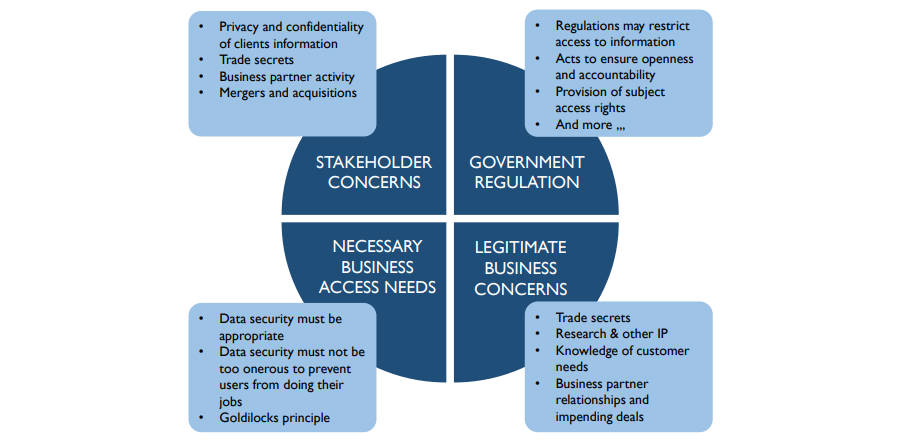

# **数据安全相关概念**

- 数据安全包括安全策略和流程的规划、开发和执行，以提供数据和信息资产的正确身份验证、授权、访问和审计（proper authentication, authorization, access, and auditing），数据安全实践的目标是根据隐私和保密法规、合同协议和业务要求保护信息资产（To protect information assets in alignment with privacy and confidentiality regulations, contractual agreements, and business requirements.）
- 数据安全要求的来源
  - 利益相关者（Stakeholders）
    - 组织必须认识到利益相关者（包括客户、患者、学生、公民、供应商或业务合作伙伴）的隐私和保密需求，组织中每个人都必须是有关利益相关者数据的负责的受托人（responsible trustee）
  - 政府法规（Government regulations）
    - 法规的出台时为了保护一些利益相关者的利益，有些法规限制对信息的访问，而另一些则确保公开、透明和问责制（openness, transparency, and accountability）
  - 专有业务顾虑（Proprietary business concerns）
    - 每个组织都有要保护的专有数据，一个组织的数据提供了对其客户的洞察力，如果机密数据被盗或泄露（is stolen or breached），组织可能会失去竞争优势
  - 合法访问需求（Legitimate access needs）
    - 在保护数据时，组织还必须使合法访问能够进行，业务过程要求特定角色能够访问、使用和维护数据
  - 合同义务（Contractual obligations）
    - 合同和保密协议也会影响数据安全要求，如PCI标准（信用卡公司和个体企业之间的协议）要求以定义等方式保护某些类型的数据，例如对用户密码进行强制加密（mandatory encryption）
- 有效的数据安全策略和流程确保正确的人能够以正确的方式使用和更新数据，并且限制所有不当访问和更新
  - 利益相关方顾虑
    - 客户信息的隐私和机密
    - 商业机密
    - 业务伙伴活动
    - 兼并和收购
  - 政府法规
    - 法规可能限制对信息的访问
    - 确保公开和问责制的行动
    - 提供主题访问权限
    - 和更多...
  - 必要业务访问需求
    - 数据安全必须适当
    - 数据安全不能过于繁重，以免妨碍用户开展工作
    - 金发姑娘原则
  - 合法业务顾虑
    - 商业机密
    - 研究和其他知识产权
    - 了解客户需求
    - 业务伙伴关系和即将进行的交易

## 数据安全的驱动因素

- 降低风险和业务增长是数据安全活动的主要驱动力，确保组织数据安全可降低风险并增加竞争优势，安全本身就是一种宝贵的资产

### 降低风险（Risk Reduction）

- 随着数据法规的增多（通常是为了应对数据盗窃和泄露），合规性要求也在增加，安全团队不仅要管理IT合规性要求，还要管理整个组织的策略、实践、数据分类和访问授权规则
- 与数据管理的其他方面一样，最好将数据安全在企业层面开展，如果没有协调一致的努力，业务部门将找到不同的解决方案来满足安全需求，从而增加总体成本，同时不一致的保护可能降低安全性，无效的安全架构或流程可能会导致组织因违规和生产力损失而付出代价
- 信息安全首先需对数据进行分类，以识别哪些数据需要保护
- 信息安全分类过程
  - 识别和分析敏感数据资产（Identify and classify sensitive data assets）
    - 敏感数据包括个人身份、医疗、财务等
  - 在企业中定位敏感数据（Locate sensitive data throughout the enterprise）
    - 安全要求取决于数据的存储位置，由于单次泄露可能造成的损害，单个位置的大量（a significant amount of）敏感数据会带来高风险
  - 确定每项资产需要如何保护（Determine how each asset needs to be protected）
    - 确保安全的必要措施取决于数据内容和技术类型
  - 识别信息如何与业务过程交互（Identify how this information interacts with business processes）
    - 对业务过程进行分析以确定哪些访问在哪些条件下允许进行
- 除了对数据本身进行分类外，还需要评估外部威胁（如来自黑客和罪犯的威胁）和内部风险（由员工和流程造成）

### 业务增长（Business Growth）

- 业务增长包括实现和维持运营业务目标，数据安全问题、漏洞和对员工访问数据的不当限制（unwarranted restrictions）会直接影响运营成功
- 值得新来的电子商务推动盈利和发展（profit and growth），产品和服务质量与信息安全直接相关，强大的信息安全可以促成交易并建立客户信心

### 安全作为资产（Security as an Asset）

- 元数据是管理敏感数据的途径之一，可以在数据元素和数据集级别标记安全分类和监管敏感性，通过数据标记技术可以使元数据随信息一起在企业内流动，开发数据特征的主存储库（a master repository of data characteristics）意味着企业的所有部分都可以准确地直到敏感西悉尼需要什么级别的保护
- 采用通用标准能够使多个部门、业务单元和供应商使用相同的元数据，标准安全的元数据可以优化数据保护并指导业务运用和技术支持流程，从而降低成本，这一层信息安全有助于防止未经授权访问和数据资产滥用，当敏感数据被正确识别时，组织可以与客户和合作伙伴建立信任
- 与安全相关的元数据本身就是一种战略资产，提高了交易、报告和业务分析的质量，同时降低了保护成本以及信息丢失或被盗的风险

## 数据安全的原则

- 协作（Collaboration）
  - 数据安全是一项涉及IT安全管理员、数据专员/数据治理、内部和外部审计团队以及法律部门的协作工作
- 企业方式（Enterprise approac）
  - 数据安全标准和策略必须在整个组织中一致
- 主动管理（Proactive management）
  - 数据安全管理的成功依赖于保持主动和动态，让所有利益相关者参与进来管理变革并克服组织或我呢话瓶颈（bottlenecks），如信息安全、信息技术、数据管理和业务利益相关者直接传统的职责分离
- 明确的责任（Clear accountability）
  - 必须明确定义角色和职责，包括对跨组织和跨角色数据的保管链（chain of custody）
- 元数据驱动（Metadata-driven）
  - 数据元素的安全分类是数据定义的重要组成部分
- 通过减少曝光来降低风险（Reduce risk by reducing exposure）
  - 最大程度地减少敏感/机密数据的扩散，尤其是在非生产环境中

## 漏洞（Vulnerability）

- 漏洞是系统中的一个弱点或缺陷（weaknesses or defect），可使得系统被攻击或妥协（compromised），一些漏洞被称为利用（exploits）
- 漏洞的示例有安装了过时安全补丁的网络计算机、未受强密码保护的网页、未受过忽略来自未知发件人的电子邮件附件的培训的用户或未受技术命令保护的公司软件
- 在许多情况下，非生产环境比生产环境更容易受到威胁，所以让生产数据远离非生产环境至关重要

## 威胁（Threat）

- 威胁是可能对组织采取的潜在攻击行动（potential offensive action），威胁可以是内部或外部的，并且并不总是恶意的（malicious），穿制服的内部人员（uniformed insider）可以在不知情的情况下在此对组织采取攻击性行动
- 威胁可能与特定的漏洞有关，可以优先修复这些漏洞，每个威胁都应有相匹配的防止威胁或限制威胁可能造成的损害的能力，一个威胁的一次发生也被称为一个攻击面（attack surface）
- 威胁的示例有发送给组织的受病毒感染的电子邮件附件（virus-infected email attachments）、使网络服务不堪重负并导致无法执行业务交易的进程（也被称为拒绝服务攻击）以及利用已知漏洞

## 风险（Risk）

- 术语风险既指损失的可能性，也指造成潜在损失的事物或条件
- 用于为每个可能的威胁计算风险的因素
  - 威胁发生的可能性及其可能发生的频率
  - 每次事件可能造成的损害类型和程度，包括声誉（reputation）损害
  - 损害将对收入或业务运营产生的影响
  - 损害发生后的修复成本
  - 抵御威胁的成本，包括补救漏洞
  - 可能的攻击者的目标或意图
- 可以结合对公司造成损害的潜在严重程度和发生的可能性来确定风险的优先级，风险优先级排序必须是利益相关者之间的正式过程

## 风险分类（Risk Classifications）

- 风险分类描述了数据的敏感性和出于恶意目的获取数据的可能性，分类用于确定谁可以访问数据，

### 关键风险数据（CRD，Critical Risk Data）

- 由于个人信息具有很高的直接财务价值，内部和外部各方都会积极寻求未经授权使用个人信息，对CRD的妥协不仅会伤害个人，还会因巨额罚款、留住客户和员工的成本以及对品牌和声誉的损害而对公司造成财务损失

### 高风险数据（HRD，High Risk Data）

- HRD由于其潜在的直接财务价值而被积极寻求未经授权的使用，HRD为公司提供竞争优势（competitive edge），对HRD的妥协可能会使公司因失去机会而遭受财务损失，HRD的损失可能导致不信任、业务损失、法律曝光（legal exposure）、监管罚款和处罚（regulatory fines and penalties）以及品牌和声誉的损失

### 中等风险数据（MRD，Moderate Risk Data）

- 对未授权方机会没有实际价值的公司信息，但未经授权使用此非公开信息可能会对公司产生负面影响

## 数据安全组织（Data Security Organization）

- 根据企业的规模，信息安全功能可能是专门的信息安全小组的主要职责，较大的企业通常由首席信息安全官（CISO，Chief Information Security Officer），其向CIO或CEO报告，在没有专职安全人员的组织中，数据安全由数据管理者（data managers）负责，在所有情况下，数据管理者都要参与数据安全工作
- 在大型企业中，信息安全人员可能会让业务管理者（business managers）指导具体的数据治理和用户授权功能，专门的信息安全人员通常最关心嘻嘻你保护的技术方面，如打击恶意软件和系统攻击

- 当IT和数据管理这两个治理实体缺乏一个有组织的流程来共享监管和安全要求时，往往失去协同作用（synergy）的机会，需要一个标准程序来相互通知数据法规、数据丢失威胁和数据保护要求，并在每个软件开发或安装项目开始时这样做
- 美国国家标准和技术研究院（NIST，National Institute of Standards and Technology）风险管理框架的第一步是对所有企业信息进行分类，创建企业数据模型对实现这一目标至关重要，如果不能清楚地了解所有敏感信息的位置，就不能创建全面有效的数据保护计划
- 数据管理者需要与信息技术开发人员和网络安全人员积极合作，以便识别受监管的数据，妥善保护敏感系统，并设计用户控制以加强保密性、完整性和数据合规性

## 安全过程（Security Processes）

- 数据安全要求和过程分为四组，被称为4A：访问（Access）、审查（Audit）、验证（Authentication）和授权（Authorization），最近为了有效的数据合规性增加了E：权限（Entitlement），实施策略和满足4A的手段有信息分类、访问权限、用户组、用户和密码，安全监控对于证明其他过程的成功是必不可少的，监控和审查都可以连续或间歇地进行，正式审查必须由来自内部或外部的第三方完成才能被视为有效
- 系统应包括检测意外事件（包括潜在的安全违规）的监控控制，包含机密信息（如工资或财务数据）的系统通常会实施主动、实时监控，以提醒安全管理员注意可疑活动或不当访问（suspicious activity or inappropriate access），一些安全系统会主动中断异常活动，在安全支持人员评估详细信息前，账户或活动将保持锁定状态，被动监控通过定期拍摄系统快照并将趋势与基准或其他标准进行比较来跟踪随时间的变化，并向负责数据的数据专员或安全管理员发送报告，主动监控是一种检测机制，而被动监控是一种评估机制
### 访问（Access）

- 使拥有授权的个人能够及时访问系统

### 审查（Audit）

- 审查安全操作和用户活动以确保符合法规并符合公司政策和标准，信息安全专业人员定期审查日志和文件，以验证是否符合安全法规、政策和标准，审查结果会定期发布

### 验证（Authentication）

- 验证用户的访问权限，方法有密码、安全令牌、回答问题或提交指纹，身份验证期间的所有传输都经过加密，以防止身份验证信息被盗

### 授权（Authorization）

- 授予个人访问适合其角色的特定数据视图的权限，授权决定后，访问控制系统会在用户每次登录时检查其是否拥有有效的授权令牌

### 权限（Entitlement）

- 权限是通过单个访问授权决定向用户公开的所有数据元素的综合，

## 数据完整性（Data Integrity）

- 在安全方面，数据完整性是完整的状态（the state of being whole），即防止不当更改、删除或添加，如在美国，Sarbanes-Oxley法案主要通过识别创建和编辑财务信息的规则来保护财务信息的完整性

## 加密（Encryption）

- 加密是将纯文本转换为复杂代码以隐藏特权信息（hide privileged information）、验证完整传输（verify complete transmission）或验证发送者身份（verify the sender’s identity）的过程，加密数据没有解密密钥或算法就无法读取，并且通常单独存储，不能根据同一数据集中的其他数据元素进行计算
- 主要的加密方法有哈希（hash）、对称（symmetric）、私钥（private-key）和公钥（public-key），具有不同程度的复杂性和密钥结构

### 哈希（Hash）

- 哈希加密使用算法将数据转化为数学表示，必须知道所使用的确切算法和应用顺序以便逆转加密过程并揭示原始数据，有时哈希被用于验证传输完整性或身份，常见的哈希算法有MD5（Message Digest 5）和SHA（Secure Hashing Algorithm）

### 私钥（Private-key）

- 私钥加密使用一个密钥来加密数据，发送方和接收方都必须拥有读取原始数据的密钥，数据可以一次加密一个字符（如在流中）或按块进行加密，常见的私钥算法有DES（Data Encryption Standard）、3DES（Triple DES）、AES（Advanced Encryption Standard）和IDEA（International Data Encryption Algorithm），使用简单的DES是不明智的，因为其容易受到许多简单的攻击

### 公钥（Public-key）

- 公钥加密中发送方和接收方使用不同的密钥，发送方使用可免费获得的公钥，接收方使用私钥来揭示原始数据，当许多数据源必须将受保护的信息发送给少数几个接收人时（如将数据提交给票据交换所时），这种类型的加密很有用，常见的公钥方法有RSA（Rivest-Shamir-Adelman）和Diffie-Hellman Key Agreement，PGP（Pretty Good Privacy）是一种免费的公钥加密应用程序

## 混淆或遮蔽（Obfuscation or Masking）

- 可以通过混淆（使模糊或不清楚）或屏蔽（删除、打乱或以其他方式改变数据的外观）来降低数据的可用性，而不会丢失数据的含义或数据与其他数据集的关系，属性中的值可能会更改，但新值对这些属性仍然有效，在屏幕上显示敏感信息或从生产数据创建测试数据集时，混淆非常有用，数据屏蔽是一种以数据为中心的安全措施，包括持久的（persistent）和动态的（dynamic）两种类型，持久屏蔽又分为不落地和落地两种

### 持久数据屏蔽（Persistent Data Masking）

- 持久数据屏蔽会永久且不可逆转地更改数据，通常不用于生产环境，而是用于生产环境与开发或测试环境之间，持久屏蔽会更改数据，但数据必须仍然可用于测试流程、应用程序、报告等
