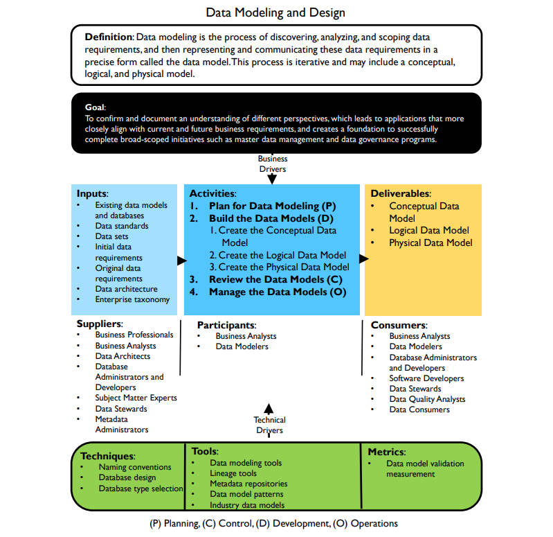

# **数据建模和设计框架**

## 定义

- 数据建模是发现、分析数据需求并确定其范围，然后以被称为数据模型的精确形式表示和传达这些数据需求的过程。这个过程是迭代的，可能包括概念、逻辑和物理模型（Data modeling is the process of discovering, analyzing, and scoping data requirements, and then representing and communicating these data requirements in a precise form called the data model. This process is iterative and may include a conceptual, logical, and physical model. ）

## 目标

- 确认并记录不同观点的理解，从而使应用程序更符合当前和未来的业务需求，并为成果完成主数据管理和数据治理方案等范围广泛的计划创造基础（To confirm and document an understanding of different perspectives, which leads to applications that more closely align with current and future business requirements, and creates a foundation to successfully complete broad-scoped initiatives such as master data management and data governance programs.）

## 输入

- 现有的数据模型和数据库（Existing data models and databases）
- 数据标准（Data standards）
- 数据集（Data sets）
- 初始数据需求（Initial data requirements）
- 原始数据需求（Original data requirements）
- 数据架构（Data architecture）
- 企业分类系统（Enterprise taxonomy）

## 提供者

- 业务专业人员（Business Professionals）
- 业务分析师（Business Analysts）
- 数据架构师（Data Architects）
- 数据库管理员和开发人员（Database Administrators and Developers）
- 主题专家（Subject Matter Experts）
- 数据转移（Data Stewards）
- 元数据管理员（Metadata Administrators）

## 活动

1. 【规划】规划数据建模（Plan for Data Modeling）
2. 【开发】构建数据模型（Build the Data Models）
   1. 创建概念数据模型（Create the Conceptual Data Model）
   2. 创建逻辑数据模型（Create the Logical Data Model）
   3. 创建物理数据模型（Create the Physical Data Model）
3. 【控制】审查数据模型（Review the Data Models）
4. 【运营】管理数据模型（Manage the Data Models）

## 参与者

- 业务分析师（Business Analysts）
- 数据建模师（Data Modelers）

## 交付

- 概念数据模型（Conceptual Data Model）
- 逻辑数据模型（Logical Data Model）
- 物理数据模型（Physical Data Model）

## 消费者

- 业务分析师（Business Analysts）
- 数据建模师（Data Modelers）
- 数据库管理员和开发人员（Database Administrators and Developers）
- 软件开发人员（Software Developers）
- 数据专员（Data Stewards）
- 数据质量分析师（Data Quality Analysts）
- 数据消费者（Data Consumers）

## 技术

- 命名规则（Naming conventions）
- 数据库设计（Database design）
- 数据库类型选择（Database type selection）

## 工具

- 数据建模工具（Data modeling tools）
- 血缘工具（Lineage tools）
- 元数据存储库（Metadata repositories）
- 数据模型模式（Data model patterns）
- 行业数据模型（Industry data models）

## 指标

- 数据模型验证测量（Data model validation measurement）