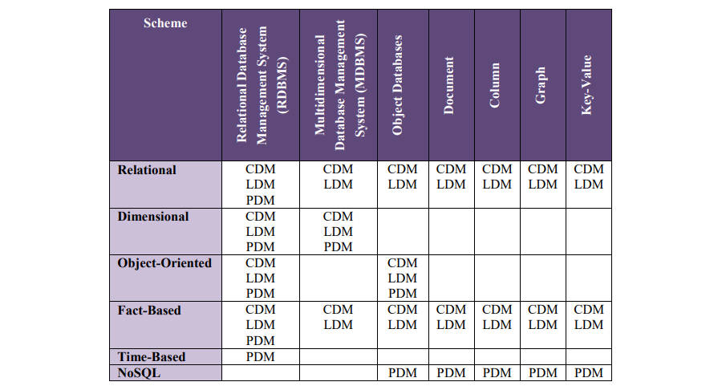

# **数据建模方案**

Data Modeling Schemes

## 建模方案和符号（Modeling Schemes and Notations）

- 关系型（Relational）
  - 信息工程（Information Engineering (IE)）
  - 信息建模集成定义（Integration Definition for Information Modeling (IDEF1X)）
  - 巴克符号（Barker Notation）
  - 陈氏符号（Chen）
- 维度（Dimensional）
  - 维度（Dimensional）
- 面向对象（Object-Oriented）
  - 统一建模语言（Unified Modeling Language (UML)）
- 基于事实（Fact-Based）
  - 对象角色建模（Object Role Modeling (ORM or ORM2)）
  - 完全面向沟通建模（Fully Communication Oriented Modeling (FCO-IM)）
- 基于时间（Time-Based）
  - 数据拱顶（Data Vault）
  - 锚建模（Anchor Modeling）
- 非关系型（NoSQL）
  - 文档（Document）
  - 列（Column）
  - 图形（Graph）
  - 键值对（Key-Value）

## 建模方案与数据库

- 方案的使用取决于正在构建的数据库，因为某些方案适用于特定技术
  - 关系型方案或基于事实方案可以为RDBMS构建所有三个层次的模型，但只能为其他类型的数据库构建概念和逻辑模型
  - 维度方案可以为RDBMS和MDBMS构建所有三个层次的模型
  - 面向对象方案可以为RDBMS和对象数据库构建所有三个层次的模型
  - 基于时间方案是一种物理数据建模技术，主要用于RDBMS环境中的数据仓库
  - 非关系型方案严重依赖底层数据库结构（文档、列、图形或键值对），是一种物理数据建模技术
- 即时使用非传统数据库（如基于文档的数据库）也可以构建关系概念模型和逻辑模型，然后构建文档物理模型

关系型（Relational）

维度（Dimensional）

面向对象（Object-Oriented）

基于事实（Fact-Based）

基于时间（Time-Based）

非关系型（NoSQL）