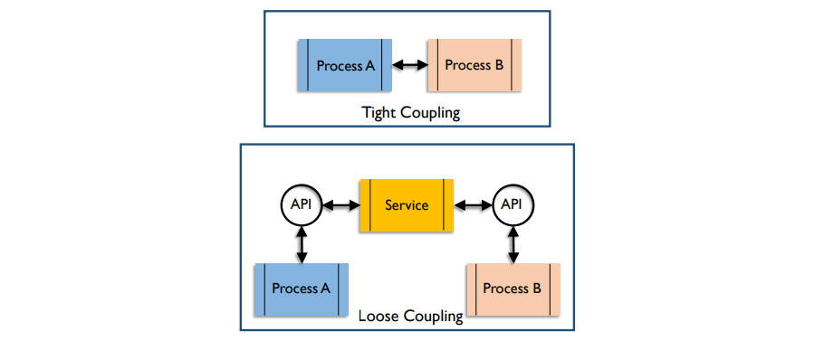
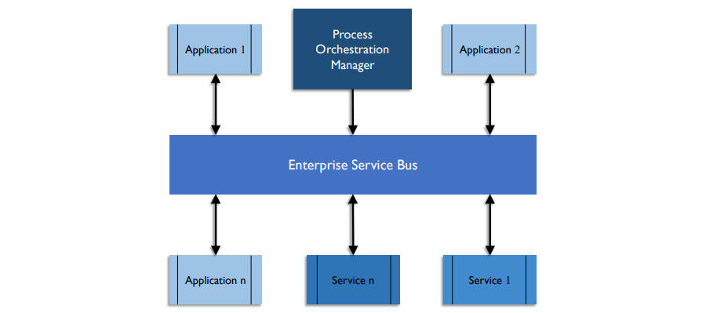

# **数据集成和互操作性相关概念**

- 数据集成和互操作性（DII）描述与数据存储、应用程序和组织的内部和之间的数据移动和整合相关的过程，集成将数据整合为一致的形式（物理形式或虚拟形式），互操作性是多个系统进行通信的能力
- DII解决方案支持的数据管理功能
   - 数据迁移和转换（Data migration and conversion）
   - 将数据整合到中心或集市中（Data consolidation into hubs or marts）
   - 将供应商软件包集成到组织的应用程序组合中（Integration of vendor packages into an organization’s application portfolio）
   - 应用程序之间和组织之间的数据共享（Data sharing between applications and across organizations）
   - 跨数据存储和数据中心分发数据（Distributing data across data stores and data centers）
   - 归档数据（Archiving data）
   - 管理数据接口（Managing data interfaces）
   - 获取外部数据（Obtaining and ingesting external data）
   - 集成结构化和非结构化数据（Integrating structured and unstructured data）
   - 提供运营情报和管理决策支持（Providing operational intelligence and management decision support）
- DII依赖的其他数据管理领域
   - 数据治理：用于管理转换规则和消息结构
   - 数据架构：用于设计解决方案
   - 数据安全：确保解决方案正确保护数据安全，包括持久数据、虚拟数据和在应用程序和组织之间移动的数据
   - 元数据：用于跟踪数据的技术清单（持久、虚拟和动态）、数据的业务含义、转换数据的业务规则以及数据的操作历史和血缘
   - 数据存储和操作：用于管理解决方案和物理实例化
   - 数据建模和设计：用于设计数据结构，包括持久数据、虚拟数据和在应用程序和组织之间移动的数据
- 数据集成和互操作性对数据仓库和商业智能以及参考数据和主数据管理至关重要，因为其都侧重于将数据从源系统转换和集成到整合的数据中心，并从中心到目标系统，交付给数据消费者（系统和人）
- 数据集成和互操作性是大数据的核心，大数据旨在整合各种类型的数据，包括数据库中结构化和存储的数据、文档或文件中的非结构化文本数据以及其他类型的非结构化数据，这些集成数据可以被挖掘，用于开发预测模型，并部署在运营智能活动中

## 数据集成和互操作性的驱动因素

- 有效管理数据移动的需求是DII的主要驱动力，大多数组织拥有大量的数据库和存储，因为管理在组织内的数据存储之间以及与其他组织之间的数据移动过程已成为每个信息技术组织的核心职责，若管理不当，数据移动过程可能会压垮IT资源和能力
- 组织从软件供应商购买应用程序而不是自定义应用程序的出现
- 管理复杂性的需要以及与复杂性相关的成本，数据集成的企业设计比点对点解决方案更高效且更具成本效益
- 管理支持成本，使用多种技术移动数据可能会导致支持成本上升，标准工具的实施可以减少支持和人员成本，并提高故障排除工作的效率，降低界面管理的复杂性可以降低界面维护成本，并允许支持资源更有效地部署在其他组织优先事项上
- 支持组织遵守数据处理标准和法规的能力，企业级DII系统支持重用代码来实施合规性规则并简化合规性验证

## 数据集成和互操作性的目标

- 以数据消费者（包括系统和人）所需的格式和时间范围提供数据
- 将数据以物理和虚拟的方式整合到数据中心
- 通过开发共享模型和接口降低管理解决方案的成本和复杂性
- 识别有意义的事件（威胁和机会）并自动触发警报和行动
- 支持商业智能、分析、主数据管理和运营效率工作

## 数据集成和互操作性的原则

- 从企业角度进行设计以确保未来的可扩展性，但通过迭代和增量交付来实施
- 平衡本地数据需求和企业数据需求，包括支持和维护
- 确保数据集成和互操作性设计和活动的业务责任，业务专家应该参与数据转换规则的设计和修改，包括持久的和虚拟的

## 抽取、转换和加载

- 数据集成和互操作性所有领域的核心是抽取、转换和加载
- 如果目标系统比源系统或中间系统具有更多的转换呢能力，则处理顺序可以变换为ELT，ELT允许在加载到目标系统后进行转换，ELT允许源数据在目标系统上实例化为原始数据，这对其他过程很有用，在ELT加载数据湖的大数据环境中很常见
- ETL流程

- ELT流程

### 抽取（Extract）

- 选择所需的数据并将其从源系统抽取

### 转换（Transform）

- 使所需数据与目标数据存储的结构兼容，转换包括数据移动到目标时从源系统删除、数据复制到多个目标以及数据用于触发事件但不持久化
- 转换样例
  - 格式变化（Format changes）
    - 数据技术格式的转换，如从EBCDIC格式到ASCII格式
  - 结构变化（Structure changes）
    - 数据结构的变化，如从非规范化记录到规范化记录
  - 语义转换（Semantic conversion）
    - 转换数据值以保持一致的语义表示，如将0、1、2、3转换为UNKNOWN、FEMALE、MALE、NOT PROVIDED
  - 删除重复数据（De-duping）
    - 确保规则需要的唯一键值或记录，包括扫描目标以及检测和删除重复行
  - 重新排序（Re-ordering）
    - 更改数据元素或记录的顺序以适应已定义的模式

### 加载（Load）

- 在目标系统中物理存储或呈现转换结果

### 映射（Mapping）

- 转换的同义词，既是开发从原结构到目标结构的查找矩阵（lookup matrix）的过程，也是该过程的结果
- 映射定义要抽取的源系统、用于识别要抽取数据的规则、要加载的目标系统、用于识别要更新的目标行的规则（如果有）以及要应用的任何转换或计算规则

## 延迟（Latency）

- 延迟是在源系统生成数据与数据可在目标系统中使用的时间差，延迟可以很高（批处理）、很低（事件驱动）、非常低（实时同步）

### 批处理（Batch）

- 大多数数据以数据块或文件的形式根据消费者的请求或按照定期计划在应用程序和组织之间移动，这种类型的交互被称为批处理或ETL
- 批处理中发生变化的数据集被称为增量，某个时间点的数据被称为快照
- 批处理对于在短时间内处理大量数据非常有用，往往用于数据仓库数据集成解决方案，即使有较低延迟的解决方案可用
- 为了实现快速处理和降低延迟，一些数据集成解决方案使用微批处理，即安排批处理以比日常更高的频率运行，如每五分钟一次
- 批处理数据集成用于数据转换、移动和归档，以及从数据仓库和数据集市中抽取和加载。批处理的时间安排存在风险。为了最大限度地减少应用程序更新问题，应在工作日的逻辑处理结束时或在夜间对数据进行特殊处理之后安排应用程序之间的数据移动。

### 变更数据捕获（Change Data Capture）

- 更改数据捕获是一种通过过滤以仅包含在定义时间范围内更改的数据来减少带宽的分发。更改数据捕获监视数据集的更改，然后将这些更改传递到使用该数据的其他数据集、应用程序和组织。作为该过程的一部分，数据还可以用诸如标志或时间戳之类的标识符来标记。变更数据捕获可以基于数据或日志。
- 基于数据的变更捕获技术
  - 源系统添加特定的数据元素，如时间戳、编码或标记，其用作更改指示器，抽取过程根据规则来标识要抽取的行
  - 当数据更改时，源系统过程被添加到一个对象和标识符的简单列表中，通过该列表控制要抽取数据的选择
  - 作为事务的一部分，源系统过程复制已更改的数据到一个单独对象，该对象用于抽取处理，其不需要位于数据库管理系统内
- 在基于日志的变更数据捕获中，通过数据库管理系统创建的数据活动日志查找特定更改，并将其转换并应用到目标数据库。复杂的转换可能会困难，可通过类似源对象的中间结构暂存更改以进行进一步处理。

### 近实时和事件驱动（Near-real-time and Event-driven）

- 大多数不采用批处理的数据集成解决方案都使用近实时或事件驱动的解决方案。数据按定义的时间表在一天内以较小的数据集进行处理，或在事件（如数据更新）发生时处理数据。近实时处理比批处理有更低的延迟，同时因为工作随时间分布，业具有更低的系统负载，但其通常比同步数据集成解决方案慢。近实时数据集成解决方案通常使用企业服务总线（enterprise service bus）来实现。

### 异步（Asynchronous）

- 在异步数据流中，提供数据的系统在继续处理前不会等待接收系统确认更新。异步意味着发送或接收系统可能会在一段时间内离线，而另一个系统不会离线。
- 由于异步中对应用程序进行的数据更新部署立即的，因此称为近实时。在近实时环境中，源系统中进行的更新与发送目标系统数据集之间的延迟通常以秒或分钟为单位进行测量。

### 实时，同步（Real-time, Synchronous）

- 当一个数据集中的数据必须与另一个数据集中的数据保持完全同步时，必须使用实时、同步的解决方案。
- 在同步集成解决方案中，执行流程在进行下一个活动或事务前等待来自其他应用程序或流程的确认。数据集可以通过数据库功能（如两阶段提交）保持同步，来确保所有更新全部成功或不进行任何更新。如金融机构使用两阶段提交解决方案来确保金融交易表和金融余额表绝对同步。
- 实时同步解决方案比异步解决方案需要更少的状态管理，因为处理事务的顺序由更新应用程序明确管理，但其可能导致其他事务的阻塞和延迟。

### 低延迟或流处理（Low Latency or Streaming）

- 低延迟数据集成解决方案旨在最大限度地缩短事件响应事件，可能包括使用固态磁盘等硬件解决方案或内存数据库等软件解决方案。
- 异步解决方案通常用于低延迟解决方案，以便事务无需等待后续流程的确认即可处理下一条数据。
- 低延迟解决方案常采用大规模多处理（massive multi-processing）或同时处理（simultaneous processing），将传入的数据同时分布到多个处理器上，而不会受到单个或少量处理器的瓶颈影响。

## 副本（Replication）

- 为了向各地的用户提供更好的响应事件，某些应用程序在多个物理位置维护数据集的精确副本。副本解决方案最大限度地减少分析和查询对主要事务操作环境的性能影响。
- 复制解决方案通常监控数据集更改日志，而不是数据集本身。从而不与应用程序竞争对数据集的访问，最大限度地减少对任何应用程序的影响。复制解决方案接近于实时，数据集的一个副本与另一个副本的更改之间存在很小的延迟。
- 当源数据集和目标数据集是彼此的精确副本时，复制工具的工作效果最佳。源和目标之间的差异会给同步带来风险。如果最终目标不是源数据集的精确副本，则有必要维护一个暂存区（staging area）来保存源数据集的精确副本，这需要额外的磁盘使用并可能需要额外的数据库技术。
- 如果数据更改可能发生在多个副本，在副本解决方案不是最佳选择。如果同一份数据可能在两个不同副本发送更改，则存在数据可能不同步的风险，或其中一个副本的更改可能会在没有警告的情况下被覆盖。

## 归档（Archiving）

- 不经常使用的数据可以转移到成本较低的数据结构或存储解决方案。
- 监控归档技术至关重要，以确保技术发送变化时数据仍然可访问。使用较旧的结构或较新的技术无法读取的存档可能存在风险，特别是法律要求的数据。

## 企业消息格式 / 规范模型（Enterprise Message Format / Canonical Model）

- 规范数据模型是组织使用的通用模型，用于标准化共享数据的格式。在中心辐射型交互设计模式中，所有想提供或接收数据的系统仅与中央信息中心交互。
- 尽管开发并商定共享消息格式是一项艰巨的任务，但拥有规范模型可以显著降低企业中数据互操作性的复杂性，从而大大降低支持成本。规范数据模型对于支持管理三个以上系统之间的数据交互是合理的，对于管理超过100个应用系统的环境中的数据交互至关重要。

## 交互模型（Interaction Models）

- 交互模型描述了在系统间建立连接以传输数据的方式。

### 点对点（Point-to-point）

- 共享数据的系统间的绝大多数交互都是点对点的，即直接互相传递数据。该模型在系统较少时是行得通的。但当许多系统需要来自相同来源的相同数据时，其效率低下并会增加组织风险。
  - 对处理的影响（Impacts to processing）
    - 如果源系统是运营系统，则提供数据的工作负载可能会影响处理。
  - 管理接口（Managing interfaces）
    - 点对点交互模型中所需的接口数量接近系统数量的平方。管理和支持接口的工作量会变得比支持系统本身还要大。
  - 潜在的不一致（Potential for inconsistency）
    - 当多个系统需要不同版本或格式的数据时会出现设计问题，使用多个接口获取数据会导致发送给下游系统的数据不一致。

### 中心辐射（Hub-and-spoke）

- 将共享数据整合到许多应用程序可以使用的中央数据中心。所有需要交换数据的系统都通过中央通用数据控制系统进行数据交换，数据仓库、数据集市、运营数据存储和主数据管理中心的就是数据中心的示例。
- 中心提供一致的数据视图，同时限制对源系统的影响。数据中心可以最大限度地减少必须访问数据源的系统和数据抽取的数量，从而减少对源系统资源的影响。向产品组合添加新系统只需要构建与数据中心的接口。
- 企业服务总线（ESB，Enterprise Service Buses）是用于在多个系统间近实时共享数据的数据集成解决方案，其中心是用于在组织中共享数据的标准格式或规范模型的虚拟概念。
- 中心辐射型并不总是最好的解决方案，某些中心辐射模型存在不可接受的延迟或性能问题，中心本身会在中心辐射架构中产生开销。点对点解决方案不需要中心，但一旦涉及三个或更多系统共享数据，中心的好处旧超过了开销的缺点。

### 发布 - 订阅（Publish - Subscribe）

- 发布和订阅模型包括推送（发布）数据的系统和拉入（订阅）数据的其他系统。订阅后当数据发布时，数据会自动发送给订阅者。

## DII架构概念（DII Architecture Concepts）

### 应用耦合（Application Coupling）

- 耦合描述了两个系统交织的程度，紧耦合（Tight Coupling）的两个系统通常具有同步接口，其中一个系统等待另一个系统的响应。紧耦合的风险更高：如果一个系统不可用，那么另一个系统也不可用，并且两个系统的业务连续性计划必须相同。
- 松耦合（Loose Coupling）是首选的接口设计，其中数据在系统间传递而无需等待响应，并且一个系统不可用不会导致另一个系统不可用。松耦合可以通过服务、API或消息队列等技术来实现。

- 使用企业服务总线的面向服务架构是松耦合数据交互设计模式的一个示例。

### 编排和流程控制（Orchestration and Process Controls）

- 编排是描述如何在系统中组织和执行多个进程的术语。所有处理消息或数据包的系统都必须能够管理这些流程的执行顺序，以保持一致性和连续性。
- 流程控制是确保数据的传输、交付、抽取和加载的准确性和完整性的组件，是基本数据移动架构中经常被忽视的一个方面。
- 流程控制的内容
  - 数据库活动日志
  - 批处理作业日志
  - 警报
  - 异常日志
  - 带有补救选项、标准响应的工作依赖图表
  - 作业时钟信息，如依赖作业的定时、作业的预期时长、计算（可用）窗口时间

### 企业应用集成（EAI，Enterprise Application Integration）

- 在企业应用集成模型中，软件模块仅通过明确定义的接口调用（API）进行交互。数据存储仅由其自己的软件模块更新，其他软件无法访问应用程序中的数据，只能通过API进行访问。EAI建立在面向对象的概念上，强调重用以及替换任何模块而不影响其他模块的能力。

### 企业服务总线（ESB，Enterprise Service Bus）

- 企业服务总线是一个充当系统之间中介的系统，其在系统之间传递消息。应用程序可以使用ESB发送和接收消息或文件，并与ESB上存在的其他进程封装在一起。作为松耦合的一个示例，ESB充当应用程序之间的服务。

### 面向服务架构（Service-Oriented Architecture）

- 面向服务架构中提供数据或更新数据（或其他数据服务）的功能通过应用程序间明确定义（well-defined: easy to see or understand）的服务调用来提供，应用程序不必与其他应用程序直接交互或了解其他应用程序的内部工作原理。SOA使应用程序独立，并使组织能够更换系统，而无需对与其交互的系统进行重大更改。
- 面向服务架构的目标是在独立的软件模块间具有明确定义的交互。面向服务的架构可以通过Web服务、消息传递、RESTful API等技术实现。服务通常被是实现为可供应用系统（或人类消费者）调用的API。

### 复杂事件处理（CEP，Complex Event Processing）

- 事件处理是一种跟踪和分析（处理）关于发生的事件的信息（数据）流并从中得出结论的方法。复杂事件处理结合来自多个来源的数据来识别有意义的事件（如机会或威胁），以预测行为或活动并自动触发实时响应，如建议消费者购买产品。
- 在很多情况下事情发生的速度使得在事件发生时检索解释事件所需的附加数据是不切实际的，高效的处理通常需要在CEP引擎的内存中预存一些数据。
- 支持复杂事件处理需要一个能够集成大量各种类型数据的环境。由于预测通常涉及数据的数量和种类，复杂事件处理通常与大数据联系在一起，其通常需要使用支持超低延迟的技术，如处理实时流数据和内存数据库。

### 数据联邦和虚拟化（Data Federation and Virtualization）

- 当数据存在于不同的数据存储中时，可以通过物理集成以外的方式将其聚集在一起。数据联邦提供对各个数据存储的组合的访问，无论其结构如何。数据虚拟化使分布式数据库以及多个异构数据存储（heterogeneous data stores）能够作为一个数据库来进行访问和查看。

### 数据即服务（DaaS，Data-as-a-Service）

- 软件即服务是一种交付和许可模式。应用程序被许可提供服务，但软件和数据位于软件供应商控制的数据中心，而不是许可组织的数据中心。提供不同层次的基础设施即服务（IT即服务、平台即服务、数据库即服务）的概念与此类似。
- 数据即服务是从供应商获得许可并按需提供数据，而不是在许可组织的数据中心进行存储和维护。如通过证券交易算出售的证券及相关价格的信息。

### 基于云的集成（Cloud-based Integration）

- 基于云的集成，也被称为集成平台即服务（IPaas，integration platform-as-a-service），是一种作为云服务提供的数据集成形式。
- 在云计算出现前，集成可以分为内部集成和企业对企业（B2B）。内部集成通过内部中间件提供服务，并通过企业服务总线（ESB）来管理系统之间的数据交换。企业间集成是通过电子数据交换（EDI，electronic data interchange）网关或增值网络（VAN，value-added networks）或市场（market places）来提供服务。
- 基于云的集成解决方案通常作为SaaS应用程序在供应商的数据中心运行，而不是在拥有被集成数据的组织中运行。基于云的集成使用SOA交互服务于要集成的SaaS应用程序数据进行交互。

## 数据交换标准（Data Exchange Standards）

- 数据交换标准是数据元素结构的正式规则。国际标准组织（ISO）及许多行业都制定了数据交换标准。数据交换规范是组织或数据交换组使用的通用模型，用于标准化数据共享的格式。
- 在系统之间达成一致的交换格式或数据布局可以显著简化企业中的数据互操作性，降低支持成本并更好地理解数据。
- 国家信息交换模型（NIEM）用于在美国政府组织之间交换数据，其目的是信息的发送者和接收者对该信息的含义有共同的、明确的理解。其使用XML进行结构定义和元素表示。