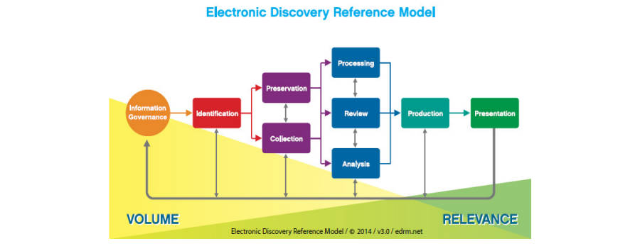

# 文档和内容管理概念

## 数据地图（Data Map）

- 数据地图是所有电子存储信息（ESI，Electronically Stored Information）数据源、应用程序和IT环境的清单，其中包括应用程序的所有者、保管人、地理位置和数据类型。

## 电子证据披露（E-discovery）

- 证据披露（discovery）是一个法律术语，指在诉讼的预审阶段，双方要求对方提供信息，以查找案件事实并了解论点的有力程度。电子文档通常具有在证据中发挥重要作用的元数据。
- 电子证据披露参考模型
  - 信息治理（Information Governance）
  - 识别（Identification）
  - 保全（Preservation）、收集（Collection）
  - 处理（Processing）、审查（Review）、分析（Analysis）
  - 生成（Production）
  - 呈现（Presentation）

## 信息架构（Information Architecture）

- 信息架构是为信息或内容创建结构的过程
  - 受控词汇表（Controlled vocabularies）
  - 分类法和本体（Taxonomies and ontologies）
  - 导航图（Navigation maps）
  - 元数据映射（Metadata maps）
  - 搜索功能规格（Search functionality specifications）
  - 用例（Use cases）
  - 用户流（User flows）
- 信息架构和内容策略共同描述了系统将管理哪些内容。
- 对于文档或内容管理系统，信息架构识别文档和内容之间的链接和关系，指定文档要求和属性，并定义文档或内容管理系统中的内容结构。
- 信息架构是开发有效网站的核心。

## 搜索引擎（Search Engine）

- 搜索引擎是根据术语搜索信息并检索内容中包含这些术语的网站的软件。
- 搜索引擎的组件：
  - 搜索引擎软件
  - 爬虫（spider）软件：用于在网络上漫游并存储所找到内容的统一资源定位器（URL，Uniform Resource Locator）
  - 遇到的关键字和文本的索引和排列规则

## 语义模型（Semantic Model）

- 语义模型是一种知识建模，用于描述概念网络及其关系。语义模型结合到信息系统中，使用户能够以非技术方式提出信息问题。如语义模型可将数据库表和视图映射到对业务用户有意义的概念。

## 语义搜索（Semantic Search）

- 语义搜索侧重于含义和上下文，而不是预先确定的关键字。其使用人工智能根据单词及其上下文来识别查询，可以通过位置、意图、词变体、同义词和概念匹配进行分析。

## 非结构化数据（Unstructured Data）

- 术语非结构化存在误导性，因为文件、图形和其他格式中经常存在结构，如章节和标题。
- 非结构化数据存在于多种电子格式中，如文字处理文档、电子邮件、社交媒体、聊天、平面文件、电子表格、XML文件、事务消息、报告、图形、数字图像、微缩胶片、视频记录和音频记录。纸质文件中也存在大量非结构化数据。