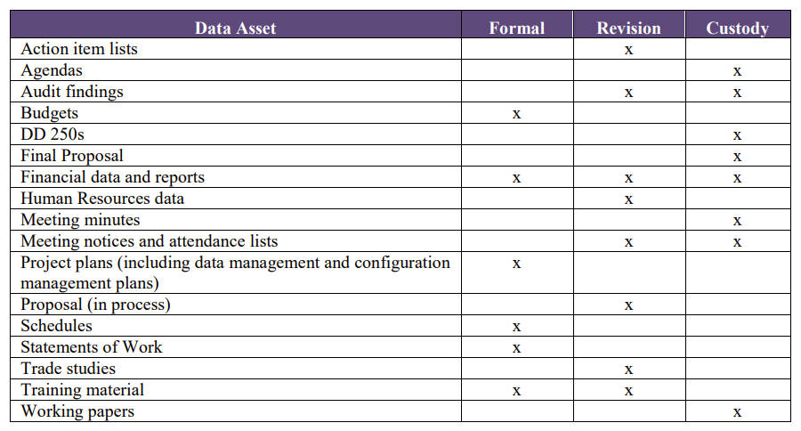

# 文档和内容管理活动

## 生命周期管理规划（Plan for Lifecycle Management）

### 记录管理规划（Plan for Records Management）

- 记录管理首先要明确记录的构成，定义记录的团队应包括该领域的主题专家（SMEs， subject matter experts）和了解记录管理系统的人员。
- 管理电子记录需决定在何处存储当前记录以及如何归档历史记录。记录方法应考虑纸质记录、非结构化和结构化电子记录。

### 制定内容策略（Develop a Content Strategy）

- 计划应考虑内容驱动因素（需要内容的原因）、内容创建和交付。内容需求应驱动技术决策，如内容管理系统的选择。
- 内容策略应从当前状态和差距评估开始，该策略定义了如何对内容进行优先级排序、组织和访问。评估通常揭示简化内容创建的生成、工作流和审批流程的方法。统一的内容策略强调设计模块化内容组件以实现可重用性，而不是创建独立的内容。
- 让人们能够通过元数据分类和搜索引擎优化（SEO，search engine optimization）找到不同类型的内容对任何内容策略都至关重要。

### 制定内容处理制度（Create Content Handling Policies）

- 制度描述原则、方向和行动指南，其帮助员工了解并遵守文档和记录管理的要求。
  - 审计范围和合规性。
  - 重要记录的识别和保护。
  - 保留记录的目的和时间表（又称保留时间表）。
  - 如何应对信息保留令（特别保护令），即保留诉讼信息的要求，即使保留时间表已过。
  - 本地和异地存储记录的要求。
  - 硬盘和共享网络驱动器的使用和维护。
  - 电子邮件管理，从内容管理角度解决。
  - 正确的记录销毁方法（如通过预先批准的供应商并收到销毁凭证）。

#### 社交媒体制度（Social Media Policies）

- 定义在社交媒体发布的内容是否构成记录，特别是员工在使用组织账户开展业务过程中发布的内容。

#### 设备访问制度（Device Access Policies）

- 制度应区分非正式内容和正式内容（如合同和协议），以便对正式内容进行控制，制度还可提供有关非正式内容的指导。

#### 处理敏感数据（Handling Sensitive Data）

- 法律要求组织通过识别和保护敏感数据来保护隐私。文档、网页和其他内容组件必须根据政策和法律要求标记为敏感。一旦标记，机密数据就会在适当时被屏蔽或删除。

#### 响应诉讼（Responding to Litigation）

- 组织应通过主动电子取证为可能提出的诉讼请求做好准备。应创建和管理数据源清单以及每个数据源相关的风险。通过识别可能包含相关信息的数据源，可以及时响应诉讼保留通知并防止数据丢失。应部署适当的技术来自动化电子证据开示流程。

### 定义信息架构（Define Information Architecture）

- 许多信息系统都包含结构化和非结构化数据，用户必须以系统检索机制可以理解的形式提交其需求，才能从这些系统获取信息。同样，存储的结构化数据和非结构化数据需要以一种格式（formart）进行描述/索引（described / indexed），以便检索机制能够快速识别相匹配的数据和信息。
- 搜索使用基于内容的索引或元数据，索引设计需考虑用户的需求和偏好，同时考虑搜索语句的拆分和语义转换。
- 应确保受控词汇表、术语、索引、信息检索分类方案、数据建模、元数据工作之间的协调。

## 管理生命周期（Manage the Lifecycle）

### 获取记录和内容（Capture Records and Content)

- 管理内容首先要对其进行获取，电子内容已存储在电子库中，为了降低丢失或损坏的风险，需扫描纸质内容，设置索引并存储到电子库，同时尽可能使用电子签名（electronic signatures）。
- 获取数据时，应使用适当的元数据对其进行标记（索引），如文档或图像标识符、获取时间、标题和作者。元数据对于检索数据和了解内容是必须的。自动化工作流和识别技术可以帮助完成获取和入库过程，并提供审计追踪（audit trail）。

### 管理版本和控制（Manage Versioning and Control）

- ANSI 859标准根据数据的重要性及数据损坏或不可用时造成的危害将数据控制分为三个级别：

  - 正式控制（Formal control）
    - 需要正式的变更发起、全面评估影响、由变更机构做出决定、向利益相关者说明实施和验证的完整进展状况。
  - 修订控制（Revision control）
    - 在需要更改时通知利益相关者并递增版本。
  - 保管控制（Custody control）
    - 最不正式的，仅需要安全存储和检索手段。

- 文档数据资产可对应的控制级别样例

  

  - 操作项列表（Action item lists）
    -  Revision
  - 议程表（Agendas）
    - Custody
  - 审计结果（Audit findings）
    - Revision、Custody
  - 预算（Budgets）
    - Formal
  - DD Form 250（DD 250s）
    - Custody
  - 最终提案（Final Proposal）
    - Custody
  - 财务数据和报告（Financial data and reports）
    - Formal、Revision
  - 人力资源数据（Human Resources data）
    - Revision
  - 会议记录（Meeting minutes）
    - Custody
  - 会议通知和出席名单（Meeting notices and attendance lists）
    - Revision、Custody
  - 项目计划（Project plans，包括数据管理和配置管理计划）
    - Formal
  - 进行中的提案（Proposal (in process)）
    - Revision
  - 日程表（Schedules）
    - Formal
  - 工作说明书（Statements of Work）
    - Formal
  - 交易研究（Trade studies）
    - Revision
  - 培训材料（Training material）
    - Formal、Revision
  - 工作文件（Working papers）
    - Custody

- ANSI 859标准建议在确定数据资产的控制级别时考虑以下标准：
  - 提供和更新资产的成本
  - 项目影响（如果变更将对成本或进度产生重大影响）
  - 变更对企业或项目的其他影响
  - 有重复使用资产或资产的早期版本的需求
  - 对变更历史记录的维护（当企业或项目需要时）

### 备份和恢复（Backup and Recovery）

- 组织整体的备份和恢复活动需包含文档/记录管理系统，包括业务连续性和灾难恢复计划。重要记录计划使组织能够在灾难期间访问开展业务和后续恢复正常业务所必需的记录。必须识别重要记录，并制定和维护重要记录的保护和恢复计划。记录管理者应参与到风险缓解（risk mitigation）和业务连续性计划活动中。
- 灾难包括电力中断、人为错误、网络和硬件故障、软件故障、恶意攻击以及自然灾害。业务连续性计划（灾难恢复计划）包括策略、流程和信息，以减轻对组织数据的威胁，并在灾难时能尽快对其进行恢复。

### 管理保留和处置（Manage Retention and Disposal）

- 有效的文件/记录管理需要明确的制度和程序，尤其是对记录的保留和处置方面。保留和处置制度将确定维护具有运营、法律、财务或历史价值文件（documents for operational, legal, fiscal or historical value）的时间范围。其确定何时可以将不活跃文档转移到次要存储设施（secondary storage facility），如异地存储（off-site storage）。该制度还具体说明了文档处置的合规流程（processes for compliance）以及方法和清单（schedules）。在制定保留清单时，必须考虑法律和监管要求（legal and regulatory requirements）。
- 记录管理员和资产所有者进行监督，以确保团队考虑隐私和数据保护要求，并采取设施防止身份盗窃（identify theft）。
- 文件保留要考虑软件问题，访问电子记录可能需要特定版本的软件和操作s系统。简单的技术变化如安装新软件可能导致文档不可读或无法访问。
- 组织应从存储中删除非增值信息（non-value-added information）并进行处置以避免浪费物理和电子空间以及对其进行维护的成本。在法律要求的时间范围后保留记录也存在风险，此信息仍可被发现以供诉讼（litigation）使用。
- 组织没有删除非增值信息的原因
  - 制度上的欠缺
  - 一方的非增值信息是另一方的有价值信息
  - 无法预见未来对非增值物理或电子记录的需求
  - 记录管理不支持（There is no buy-in for Records Management）
  - 没有能力决定要删除的记录
  - 考虑到做出决策并删除物理或电子记录的成本
  - 电子空间廉价，在需要时扩展空间比归档和删除过程更容易

### 审计文档和记录（Audit Documents / Records）

- 文档/记录管理需要定期审计，以确保在正确的时间将正确的信息提供给正确的人，来进行决策或执行运营活动。审计指标示例：

## 发布和传递内容（Publish and Deliver Content）

### 提供访问、搜索和检索（Provide Access, Search, and Retrieval）

### 通过可接受的渠道传递（Deliver Through Acceptable Channels）