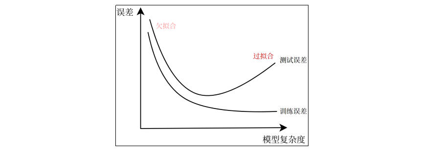

# 模型评估和模型选择

## 损失函数

- 对于模型一次预测结果的好坏，需要有一个度量标准。
- 对于监督学习而言，给定一个输入X，选取的模型就相当于一个“决策函数”f，可以输出一个预测结果f(X)，而真实的结果（标签）记为Y。f(X) 和Y之间可能会有偏差，使用损失函数（loss function）来度量预测偏差的程度，记作 L(Y,f(X))。
- 损失函数用来衡量模型预测误差的大小；损失函数值越小，模型就越好。
- 常见的损失函数

## 经验误差

- 给定一个训练数据集，数据个数为n。根据选取的损失函数，可以计算出模型f(X)在训练集上的平均误差，称为训练误差或经验误差（Empirical Error）。
- 在测试数据集上的评价误差，被称为测试误差或泛化误差（Generalization Errot）。
- 模型评估的一般策略是考察经验误差，当经验误差最小时即认为取到了最优的模型，这种策略被经验风险最小化（ERM，Empirical Risk Minimization）。

## 欠拟合和过拟合

- 拟合（Fitting）是指机器学习模型在训练数据上学习到规律并生成预测结果的过程。理想情况下，模型能够准确地捕捉训练数据的模式，并在测试数据上也有良好的表现，即模型具有良好的泛化能力。

- 欠拟合（Underfitting）：模型在训练数据上表现不佳，无法很好地捕捉数据中的规律。

- 过拟合（Overfitting）：模型在训练数据上表现很好，但在测试数据上表现较差的情况。过拟合的模型对训练数据中的噪声或细节过度敏感，把训练样本自身的一些特点当作了所有潜在样本都会具有的一般性质，从而失去了泛化能力。

- 欠拟合和过拟合的根本原因是模型复杂度过低或过高，从而导致泛化误差偏大。
  - 欠拟合：模型在训练集和测试集上误差都比较大，模型过于简单，高偏差。
  - 过拟合：模型在训练集上误差较小，在测试集上误差较大，模型过于复杂，高方差。

### 欠拟合的原因与解决

- 产生原因
  - 模型复杂度不足，模型过于简单，无法捕捉数据中的复杂关系。
  - 特征不足，输入特征不充分或特征选择不恰当，导致模型无法充分学习数据的模式。
  - 训练不充分，训练过程中迭代次数太少，模型没有足够市级学习数据的规律。
  - 过强的正则化，正则化项设置过大，强制模型过于简单，导致模型无法重复拟合数据。
- 解决方法
  - 增加模型复杂度，选择更复杂的模型。
  - 增加特征或改进特征工程，添加更多的特征或通过特征工程来创造更有信息量的特征。
  - 增加训练时间，增加训练的迭代次数，让模型有更多机会去学习。
  - 减少正则化强度，如果使用了正则化，尝试减小正则化的权重，让模型更加灵活。

### 过拟合的原因与解决

- 产生原因
  - 模型复杂度过高，模型过于复杂，参数过多。
  - 训练数据不足，数据集太小，模型能记住训练数据的细节，但无法泛化到新数据。
  - 特征过多，导致模型学习到训练数据中的噪声，而非数据的真正规律。
  - 训练时间过长，导致模型学习到训练数据中的噪声，而非数据的真正规律。
- 解决方法
  - 减少模型复杂度，降低模型的参数数量，使用简化的模型或降维。
  - 增加训练数据，收集更多数据，或通过数据增强来增加训练数据的多样性。
  - 使用正则化，引入L1、L2正则化，避免过度拟合训练数据。
  - 交叉验证，使用交叉验证技术评估模型在不同数据集上的表现，以减少过拟合的风险。
  - 早停机制，训练时当模型的验证损失不再下降时，提前停止训练，避免过度拟合训练集。