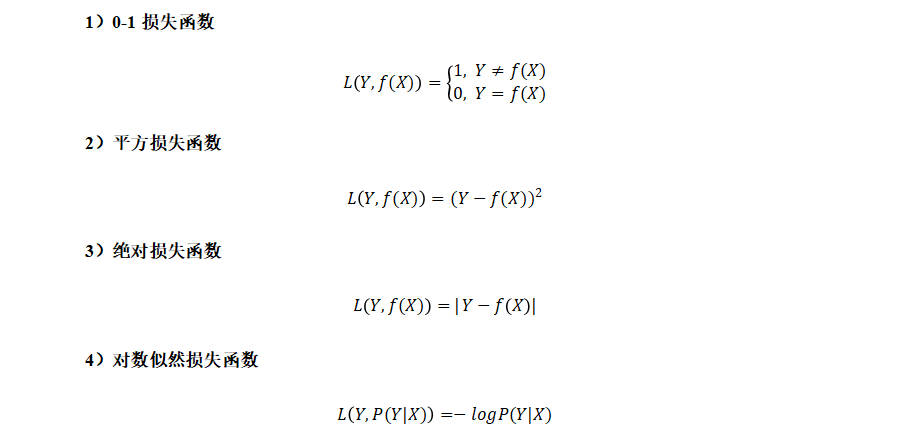

# 模型评估和模型选择

## 损失函数

- 对于模型一次预测结果的好坏，需要有一个度量标准。
- 对于监督学习而言，给定一个输入X，选取的模型就相当于一个“决策函数”f，可以输出一个预测结果f(X)，而真实的结果（标签）记为Y。f(X) 和Y之间可能会有偏差，使用损失函数（loss function）来度量预测偏差的程度，记作 L(Y,f(X))。
- 损失函数用来衡量模型预测误差的大小；损失函数值越小，模型就越好。
- 常见的损失函数

