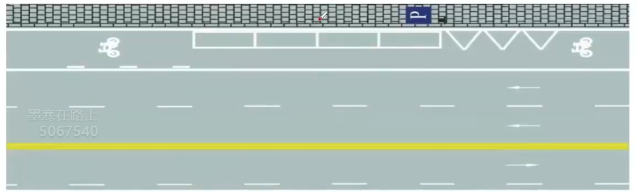
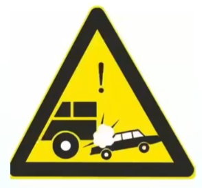
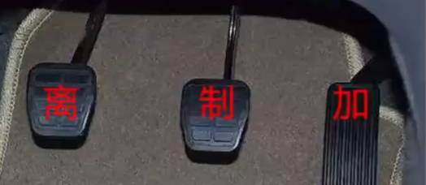

## 驾驶证有关考点

- C1 准予驾驶C2 C3 C4

- C6 轻型牵引挂车，年龄**20-60**，增驾需小型汽车、小型自动挡汽车驾驶证**一年以上**

- B1 中型客车

- B2 大型货车

- A1 大型客车

- A2 重型牵引挂车

- 申请小型汽车驾驶证年龄要求：**18-无上限**，70周岁，记忆力、判断力、反应力三力测试，每年体检

- 驾驶证有效期：**6-10-长**

- 大中客货公交牵引**每年**体检

- 体检放宽到乡镇社区服务医院体检机构等

- 非营运小客车、摩托车自注册登记起第6年、第10年到检验机构上线检验，**在10年内每两年**向公安机关申领一次检验合格标志，**超过10年每年**上线检验1次

- 关于时间：**满9变3**，**有90选90，没90选30，判断题30大多数正确**

- 驾驶证**周期**：**12**个月

- 驾驶证**实习期**：**12**个月

- 驾驶证满分：12分

- 有效期：3年，准考证3年，实习期上高速3年驾龄陪同，因XX原因不能审验3年

- 年龄20能考货车

- 实习期不可单独驾驶机动车上高速公路行驶，在增驾准驾车型后的实习期，驾驶原准驾车型不受此限制

- 同一机动车所有人名下两辆机动车，若申请前无未处理的道路交通安全违法和交通事故记录，可进行号牌号码互换

- 满分教育日问题
  - 日期
    - **小车**：**现场2天**、网络3天、自主2天，**共7天**
    - 大车：现场5天、网络5天、自主20天，共30天
    - **每增加12分，自主时间小车加7天（最多60）**，大车加30天（最多120），现场和网络天数不变
  - 考试
    - **满12分（参加科目一考试）**
    - **满24-36分（参加科目一、科目三考试）**
    - **满36分（参加科目一、科目二、科目三考试）**
  
- 一个记分周期内累积未满12分，但有罚款逾期未缴纳的，该记分周期内尚未缴纳罚款的交通违法行为记分分值转入下一记分周期

- 一个记分周期期限届满，累计积分未满12分，该记分周期内的记分予以清除

- 学法减分
  - 不可参加
    - **实习期内**
    - **有二次以上参加满分教育记录**
    - **酒驾被处罚的3个记分周期内**
  - **每个周期最多减6分**
  - 方式
    - 网络学习（3天内）：**30**分钟，需参加考试，扣减**1**分
    - 现场学习：**1**小时，需参加考试，扣减**2**分
    - 公益活动：**1**小时，不需参加考试，扣减**1**分

- 科目二/科目三=**预约次数5**

- 出现科目二/科目三
  - 题目中**没有分数**的判断题都是正确的，有分数的是错误的
  - 若参加不了考试，提前一日取消，否则算考试不合格
  
- **行为**前面找**违法**（违法行为）

- **责任**前面找**刑事**或**全部**（刑事责任、全部责任）

- 车登记，证随意（除驾驶证外都是车的，如号牌等）
  - 驾驶证遗失、损毁需补领（核发地、居住地、所在地、户籍地等）
  - 颜色变、车架变、发动机，要登记。加防撞，不用登（只有防撞不用登记）
  
- 驾驶证没带、丢失、损毁、过期、延期审验、被吊销、被扣押都不能驾驶机动车，并且被依法扣押扣留不能申请补发（被注销、被吊销都正确，不注销、不吊销都错误）

- 科目一中法律法规的直接选

- 不得申请驾驶证的时间：假1骗3毒3醉5逃罪终生（假：作弊，骗：不正当）

## 安全常识考点

- ABS车轮防抱死，需要**用力踏**（ABS找紧急制动）

- 安全带可以减轻对驾乘人员的伤害（安全带找减轻）

- 安全头枕保护颈部，放在支撑头部的位置

- 安全气囊辅助可充气约束系统（安全气囊选辅助）

- 醉驾：血液中酒精含量大于**80毫克/100毫升**

- 车道偏离预警系统（**LDW**，Lane Departure Warning System）

- 车辆自适应巡航控制系统（**ACC**，Adaptive Cruise Control）

- 不得有下列行为：

  - 在车门、车厢未关好时行车
  - 在禁止鸣喇叭区域鸣喇叭
  - 拨打接听手持电话、观看电视等妨碍安全驾驶的行为
  - 熄火/空挡/惯性滑行（只要滑行就错）
  - 向道路上抛撒物品
  - 无论前后排大人儿童未系安全带
  - 在驾驶室前后窗范围内悬挂、放置妨碍驾驶人视线的物品
  - 连续驾驶超过4小时未停车休息或停车休息时间少于20分钟
  - 冬季给电动汽车充电前未预热电池
  - 驾驶电动汽车出行前未检查剩余电量
  - 电动汽车使用普通灭火器

## 扣留拘留题目

- 扣留选择题
  - **两证：驾驶证、行驶证**
  - **两标：保险标志、检验合格标志**
  - **一牌：车牌**
- 扣留判断题
  - 两种错误情况
    - 扣留行驶证
    - 没带身份证
- 拘留判断题
  - **跟钱在一起的拘留是对的**，没有钱的拘留是错的

## 判刑题目

- 出现重大事故致人重伤、死亡，3年以下或者拘役
- 出现重大事故致人重伤、死亡**且逃逸**，申请人在机动车驾驶人考试过程中组织作弊，3年以上7年以下
- 出现重大事故因**逃逸致人死亡**，7年以上
- 有拘役选拘役，有拘役就对，有期徒刑结尾为错
- **且找3-7，组织作弊找3-7，因找7以上**

## 事故处理

- 有争议、有人员伤亡、有喝酒司机、有违法行为都立刻报警（判断有报警对）
- 无争议、无人员伤亡（轻微刮擦等）撤离现场自行协商
- 交通肇事罪的三个未开头的选一个不一样的

## 通行原则

- 有加速都是错的
- 通行时让是对的
- 减速慢行、减速靠右、减速或停车、停车避让是对的
- 不用减速慢行、无需减速、不必减速是错的
- 不得绝大多数是对的
- 主动、依次、顺序、有序、礼让、注意避让、确认安全、安全距离、减少并行时间是对的
- 持续/连续/长按喇叭是错的，催促、逼迫、迫使、抢、占、保持原速是错的
- 顺序通行三大原则
  - **转弯让直行**
  - **右转弯让左转弯**
  - **同样直行右侧先行**
- 超车只能从左侧超车，若无法保证与被超车辆的安全间距，应主动放弃超车，停止超车
- 不得超车的情况
  - 前车正在左转弯、掉头、超车的；与对面来车有会车可能的
  - 前程为执行紧急任务的警车、消防车、救护车、工程救险车的
  - 特殊道路如行经**铁路道口、交叉路口、窄桥、弯道、陡坡、隧道、人行横道、市区交通流量大的路段**等没有超车条件的（也不能倒车停车）
- 看线
  - 提到虚线才可以越线、掉头、超车等，实线不可过线不可压线
- 铁路道口、漫水路、漫水桥三原则（1停2看3通过）
  - **停下来**
  - **看观察确认安全**
  - **低速通过，进入铁路道口后不能变换挡位**（因为已经低挡低速在通过）
- 故障处理步骤
  - **开启危险报警闪光灯**
  - **移到不妨碍交通的地方，若无法移动则继续第三步**
  - **放置警告标志（普通道路50-100米之间，高速150米以外）**
  - **下车去安全地带（右侧路肩）报警等待救援**
- 若道路没有划分机动车道、非机动车道和人行道，应在道路中间通行，给行人和非机动车在两侧留有充足的空间
- 变更车道步骤
  - **打开转向灯**
  - **观察确认安全**
  - **平稳变道（直接、迅速错误），完成后关闭转向灯**
- 停车距离（口5站3）
  - 交叉路口、铁路道口、急转弯、窄路、桥梁、陡坡、隧道**50米以内**不得停车
  - 公告汽车站、急救站、加油站、消防栓或消防队（站）**门前及距离上述地点30米内**不得停车
- 驾驶机动车遇前方交叉路口交通堵塞，或看到图中堵车，只能依次排队在路口外，不能进入路口（有依次、顺序直接选，没有则选路口外）
- 狭窄山路会车，靠山体的一方让不靠山体的一方先行、环岛外的车让环岛内的车先行、有障碍的一方让无障碍的一方先行、辅路车让主路车先行（主路车流大速度快）
- 看到随意二字直接判断错误（只有行人具有随意性的特点是正确的）
- 车前方校车问题
  - **两条车道，前方有校车停下来等待**
  - **三条车道，可提前变道最左侧超越**
- 除警察安排或急救他人外，不可在紧急停车道（应急车道）行驶

## 速度有关考点

- 速度不得超过每小时30公里
  - 冰雪、泥泞道路
  - 进出非机动车道，通过铁路道口、急转弯、窄路、窄桥
  - 掉头、转弯、下陡坡
  - 雾、雨、雪、沙尘、冰雹，能见度50米以内
  - （科目一中特殊道路都是30公里/小时，判断题速度不是30或100错误）
  
- 高速路能见度、速度、距离
  - **261，145，52离**
    - 能见度200以下，车速不超过每小时60公里，与前车至少100米以上
    - 能见度100以下，车速不超过每小时40公里，与前车至少50米以上
    - 能见度50以下，车速不超过每小时20公里，尽快驶离高速路
  
- 高速路速度
  - **红高蓝低黄建议**
    - 红色最高速度不能超过
    - 蓝色最低速度不能低于
    - 黄色为建议速度
  
- 路面速度
  - **黄高白低**
    - 黄色最高速度不能超过
    - 白色最低速度不能低于
  
- 安全距离
  - **速度高于100，距离100以上**
  - **速度低于100，距离50以上**
  
- 高速路车道限速
  
  - 左快右慢
  
  - **三条车道**
    - **11-12，9-11，6-9**
  - **两条车道**
    - **10-12，6-10**
  - 高速最慢60
  
- 设计时速低于70的机动车不得进入高速路

- 城市和公路限速
  - **没有中心线，城3公4**
  - **有中心线，城5公7**

## 特殊天气

- 特殊天气的灯光，只有雾天雾灯，没有特殊灯光
- 关键字答题
  - 雨天找滑字
  - 冰雪找制动，制动变长，雪天找车辙
  - 泥泞找车轮
  - 雾天夜晚找能见度，并且回应喇叭正确
  - 水淹路面找观察路面
  - 车辆涉水找间断轻踏，没有间断轻踏找轻踏
- 困难/无法找停车
- **特殊情况和特殊天气都应发动机制动减速，紧急制动减速错误**
- 有车辙为特殊路面，选择坚实路面行驶，缓慢通过，大安全距离

## 交警手势

- 手心高举，停止等待
- 双臂伸直，直行
- 回弯，变道
- 两只手一高一低，向在下侧转弯
- 左手越过伞杆，左转弯待转
- 一只手一高一低，减速慢行

## 灯光

- 近光灯：有车、有人、照明条件良好、隧道
  - 题目中有人、有车、跟车、会车，需要将远近光灯转换为近光灯
  - 夜间会车遇到对向来车需要在**150米外**转换为近光灯
- 远光灯：照明条件不好可以开（判断题开远光灯都是错误）
  - 跟车、尾随车、会车（无论下雪下雨）禁止使用远光灯，避免灯光照射前车后视镜造成驾驶人眩目
- 交替使用远近光灯（有远近的判断对）
  - 超车（用于提醒前车）
  - 夜间特殊道路（如交叉路口、急转弯、人行横道、坡路、拱桥等）
  - 提醒开远光灯的人
- 雾灯：只有雾天开雾灯
- 危险报警闪光灯
  - 临时停车
  - 故障
  - 雾天
  - 牵引故障车
- 左转向灯：只要有向左的动作就要开，左转弯、掉头、超车、向左变道、**进高速口**
- 右转向灯：只要有向右的动作就要开，右转弯、向右变道、靠边停车、**出高速口、出环岛**（环岛只有出需要开右转向灯）

## 标志与信号

### 道路标志

- **圆形红/绿/黄灯可以右转**

- 黄灯

  - 三框：警示，信号暂时解除（越过停止线的可继续通行）
  - 一框：危险注意安全

  

- 哪侧通行

  - 上半部哪侧有三角形

  

- 停车

  - 禁止长时间停车
    - 斜杠标志
    - 路边黄虚线
  - 禁止停车
    - 叉号标志
    - 路边黄实线

  

- 导向车道线

  - 无齿：导向车道线
  - 有齿：可变导向车道线

  

- 道路出入口

  

- 减速标记

  - 纵向
  - 横向

  

- 立面标记：黄黑

  

- 障碍物标记

  

- 网状线：不能停车

  

- 导向线

  

- 中心圈

  

- 人行横道预告

  

- 禁止右转

  

- 左右转弯

  

- 导流线

  

- 禁止标线：不可越线

  

- 指示标线：分隔对向交通流，可越线超车或转弯

  

- 停车位

  - 平行式停车位

    

  - 固定方向停车位

    

  - 限时停车位

    

- 指示前方有左弯或需向左合流

  

- 港湾式停靠站

  

### 警示标志

- 交叉路口

  

- 注意电动自行车

  

- 注意危险

  

- 注意合流

  

- Y型交叉口

  

- 有障碍物左右绕行

  

- 双向交通

  

- 傍山险路

  

- 注意落石

  

- **路面变窄**

  

- **窄桥**

  

- **有人看守**

  

- **无人看守**

  

- 1红色斜杠=50米

  

- **急转弯、反向弯路、连续弯路**

  

- **减速丘、路面高低不平、路面低洼、驼峰桥**

  

- 堤坝路

  

- 易滑路段

  

- 注意大风

  

- 事故易发路段

  

- 潮汐车道

  

- 注意行人、注意非机动车

  

- 双向交通、分离式道路

  

- 渡口

  

- **隧道**（不是涵洞，科目一无涵洞）

  

- 注意儿童

  

### 允许标志

- 人行横道、非机动车道

  

- 干路先行

  

- 左转弯、左右转弯

  - 方框、圆圈里的箭头是转弯，虚实线考察变道

  

- 分向行驶车道

  

- **单行道、只准直行、直行车道**

  

- **会车让行、会车先行**

  - 加粗先行、红色让行

  

- 立体交叉直行和右转弯行驶、立体交叉直行和左转弯行驶

  

- 中间圆环找环

  

- Y型交叉路口

  

- 分隔带右侧行驶、分隔带左侧行驶

  

- 室内停车场、露天停车场

  

- 车道数变少、车道数增加

  

- 机动车行驶、多乘员

  

- 此路不通

  

- BRT车辆专用车道（Bus Rapid Transit）、公交线路

  

- 线形诱导标志

  

- 应急避难场所

  

- 错车道

  

- 出口

  

- 开车灯

  

- 硬路肩允许行驶路段开始、即将结束、结束

  

- 超高绕行

  

- 靠右侧车道行驶

  

### 禁止标志

- 禁止长时间停车、禁止停车

  

- 禁止通行

  

- 停车让行

  

- 减速让行

  

- 禁止驶入

  

- **解除禁止超车**

  

### 高速标志

- 高速公路起点、终点

  

- **高速公路服务区、停车区、停车场**

  

- 高速紧急停车带

  

- 高速紧急电话

  

## 仪表指示灯

- 速度和里程表：数字过百

- 发动机转速表：速度小到8

- LOCK：切断电源，锁定方向盘

- ACC：接通附件电源（如收音机等附件）

- ON：接通除起动机外的全车全部电源（发动机工作，发动机未启动）

- START：接通起动机电源，启动发动机

- 14对23错

- 车门锁住开锁

  

- 儿童安全锁

  

- 车灯总开关

  

- 前挡风除雾、后挡风除雾

  

- 远光灯、近光灯、前雾灯、后雾灯

  

- **前风窗玻璃刮水器及洗涤器、后风窗玻璃刮水器及洗涤器**

  

- 前后位置灯示廓灯

  

- 水温表（发动机温度过高，冷却液不足）

  

- 冷却液不足

  

- 危险报警闪光灯（临时停车或故障时手动打开）

  

- 制动系统故障

  

- 防抱死制动系统故障

  

- 充电电路故障

  

- 驻车制动器处于制动状态（手刹没松开）

  

- 外循环

  

- 内循环

  

- **机油压力过低**

  

- **燃油不足**

  

- 安全气囊故障

  

- 发动机控制系统故障

  

- 离合器、刹车、油门

  

- 变速器

  

- 驻车制动器

  

- 左车、右水

  

  

- 上右、下左转向灯

  

- 两侧车门未关闭

  

## 扣分项目

- **超速**
  - 小型汽车（驾驶校车、中型以上载货汽车、危险品运输车辆以外的其他机动车）
    - 普通道路
      - **20%-50%：3**
      - 50%以上：6
    - 高速道路
      - 20%-50%：6
      - 50%以上：12
  - 中型客车以上（校车、危险运输车）
    - 普通道路
      - **10%-20%：1**
      - 20%-50%：6
      - 50%以上：9
    - 高速道路
      - 20%以下：6
      - 20%以上：12
- **超员**
  - 校车、公路客运汽车、旅游客运汽车
    - 20%以下：6**【6】**
    - 20%以上：12
  - 7座以上载客汽车
    - 20%-50%：6**【6】**
    - **50%-100%：9**
    - 100%：12
  - 其他载客汽车
    - **20%-50%：3**
    - 50%-100%：6**【6】**
    - 100%：12
- **超载**
  - 驾驶载货汽车载物
    - 30%以下：1
    - 30%-50%或违反规定载客：3
    - 50%以上：6
- 其他扣1分情况
  - 驾驶未按规定定期进行**安全技术检验**的公路客运汽车、旅游客运汽车、危险品运输车以外的机动车上道路行驶
  - 驾驶机动车不按规定**会车**，普通道路不按规定**倒车掉头**
  - 违反**禁令标志、禁止标线**
  - 不按规定使用**灯光**
  - 不按规定系**安全带**
  - 驾驶机动车**载货长宽高**超过规定
  - 驾驶擅自改变已登记的**结构、构造或特征**的载货汽车上道路行驶
  - 驾驶摩托车不戴安全**头盔**
- 其他扣3分情况
  - 拨打接听手**机**
  - 在路上出现事故/故障停车后，未按规定**使用灯光和放置警告标志**
  - 普通道路/高速以外道路上**逆行**
  - 借道/占道**对面车道**穿插
  - 不避让**校车**
  - 不按规定安装**号牌**
  - 驾驶校车上道路行驶前，未对**校车车况**是否符合安全技术要求进行检查，或驾驶存在安全隐患的校车上道路行驶
  - 驾驶未按规定进行**安全技术检验**的公路客运汽车、旅游客运汽车、危险品运输车上道路行驶
  - 载货汽车4小时未停车或者休息少于20分钟（**载货3载客9**）
  - 高度公路行驶低于**最低时速**
  - 不按规定超车**让行**、人行横道不安规定减速停车**避让行人**、高速公路/城市快速路**不按车道行驶**
- 其他扣6分情况
  - 违法占用**应急车道**
  - 驾驶证**被暂扣期间驾驶**机动车
  - 没有遵守**交通信号灯**
  - **逃逸轻伤以下**
  - 驾驶机动车运载**超限不可解体的物品**，未按指定时间路线行驶或未悬挂警示标志
  - 驾驶机动车运输**危险化学品**，未经批准进入危险化学品运输车辆限制通行的区域
  - 驾驶机动车载运**爆炸品、易燃易爆化学品以及剧毒、放射性危险品**，未按指定时间、路线、速度行驶或未悬挂警示标志并采取必要安全措施
- 其他扣9分情况
  - **高速公路城市快速路违法停车**
  - 未悬挂**号牌**、故意遮挡污损号牌
  - 驾驶**车型**不符
  - 未取得**校车驾驶资格**驾驶校车
- 其他扣12分情况
  - **饮酒**
  - 使用**伪造、变造**的驾驶证/行驶证/号牌
  - **逃逸轻伤以上**
  - **高速上倒车、逆行、穿越分隔带**
  - **代替实际驾驶人**接受违法行为处罚和记分牟取利益

## 罚款项目

- 处理处罚
  - **1罚2吊**，1罚款2吊销（顺序选，罚款除**实习期单独上高速/补领机动车驾驶证**外有20不选），有罚款直接选
  
- 未按照规定/未及时
  - 罚款200以下
  
- 申请人
  - 罚款2000以下
  - 假1骗3
    - 舞弊：1年
    - 欺骗：3年
  
- 分相关
  - 买分、卖分
    - 所得/所支付**三倍以下**罚款，**不超过五万**
  
- 作假
  - **扣减记分、满分学习**时作假：**1000**以下
  - **申请驾驶证**作假：**500**以下
  
- 代替
  - 代替审验教育、满分教育、学法减分：2000以下
  
- 组织
  
  - 满分教育、审验教育：3倍，两万以下
  
  - 买分、卖分：5倍，十万以下
  - 欺骗驾驶证：3-5倍，十万以下
  
- 补领驾驶证后继续使用原驾驶证：20-200

- 喷涂、粘贴标志或车身广告，影响安全驾驶：200以下

- 醉酒饮酒同时出现选饮酒

- 再次饮酒后驾驶，1000-2000，10日一下拘役

- 超速50%，罚款200-2000并吊销驾驶证

## 其他

- 拘役正确
- 无未正确
- 酒12分
