## 行程详情

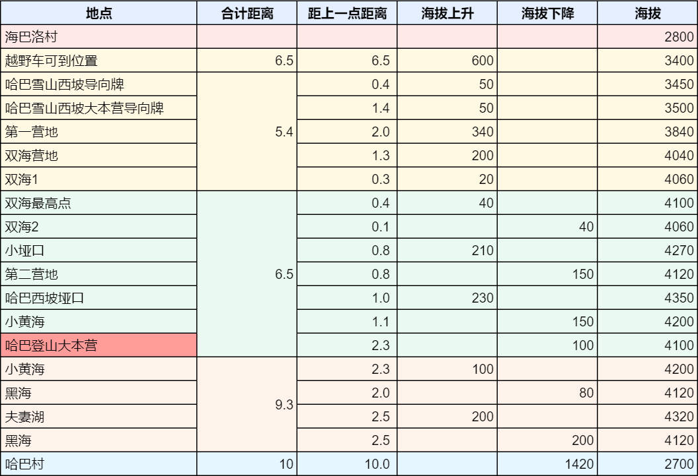

## 行程地点

#### 越野车可到位置

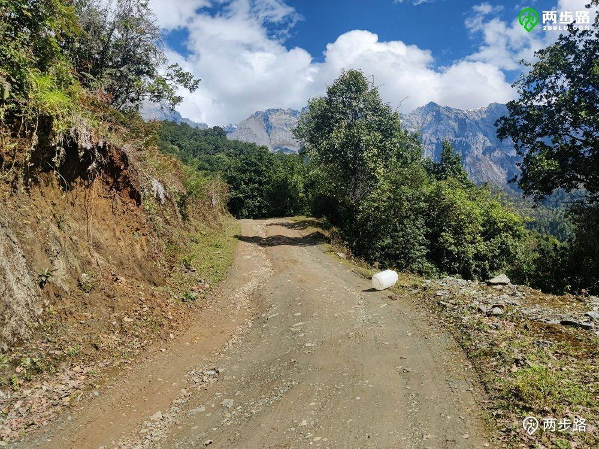

#### 哈巴雪山西坡导向牌

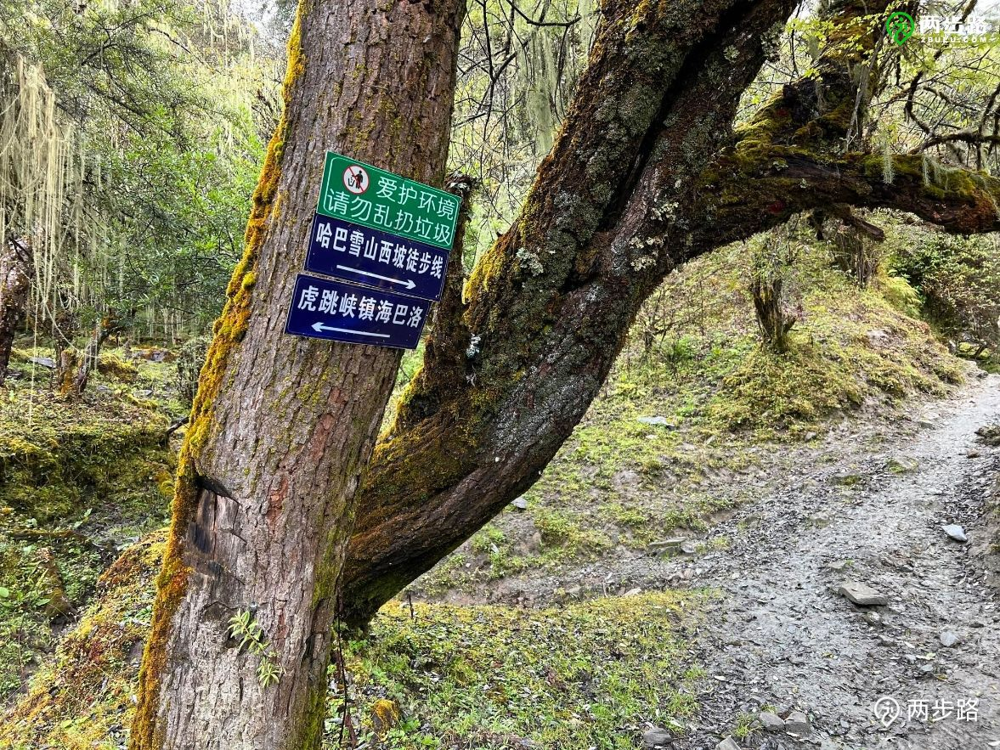

#### 哈巴雪山西坡大本营导向牌

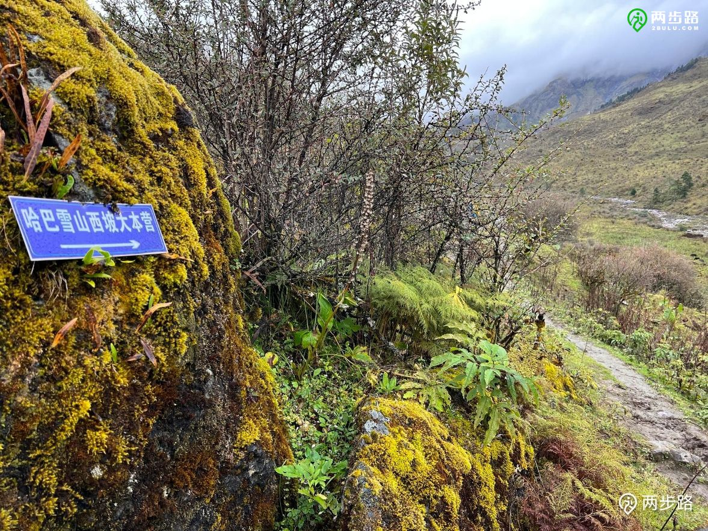

#### 第一营地

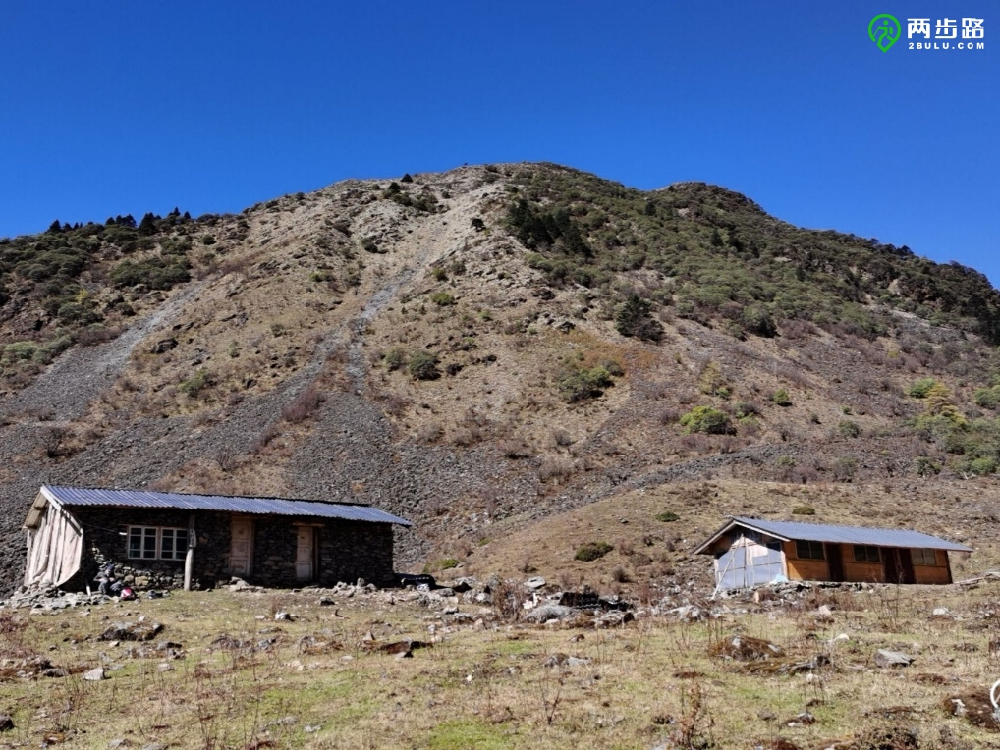

#### 双海营地

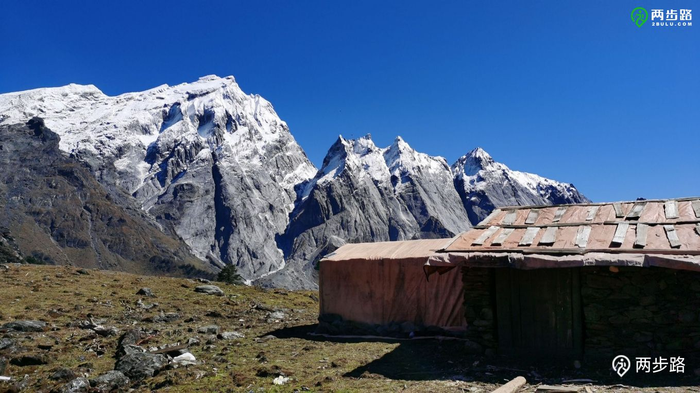

#### 双海1

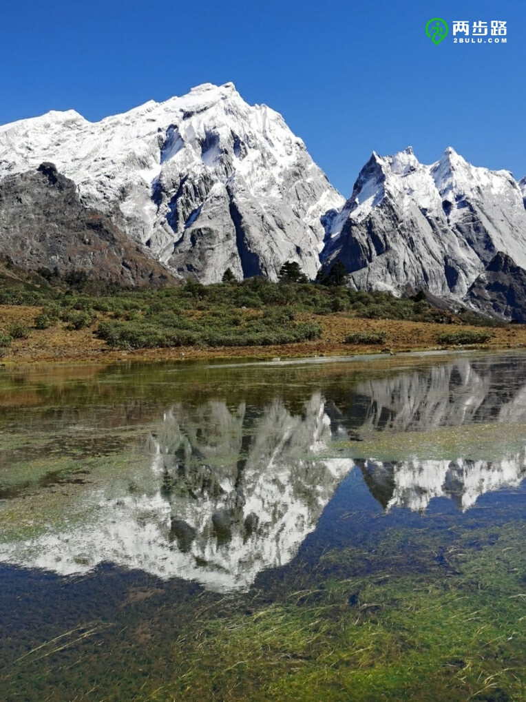

#### 双海2

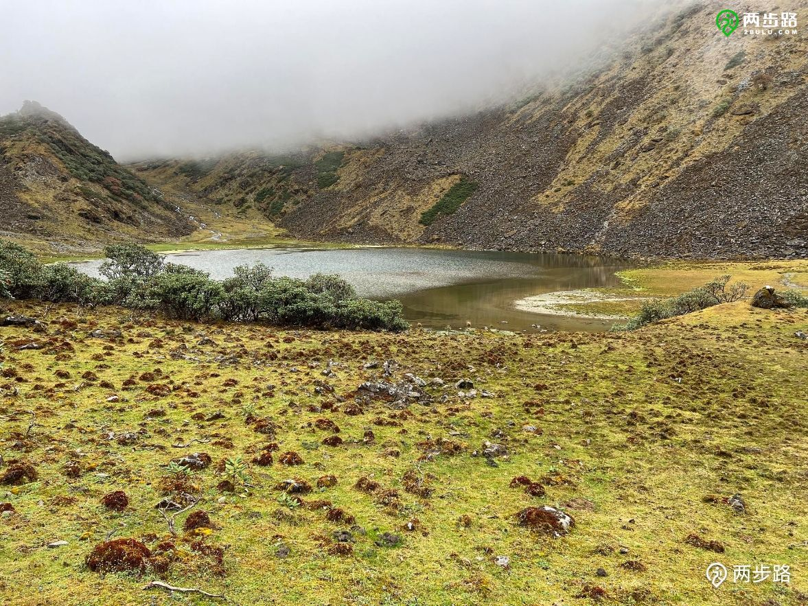

#### 第二营地

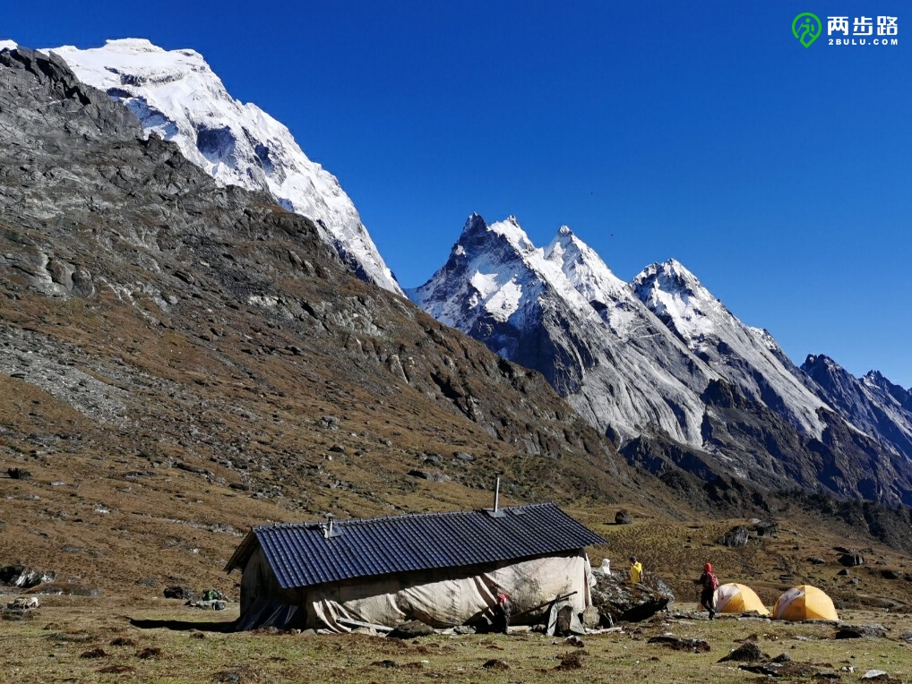

#### 哈巴西坡垭口

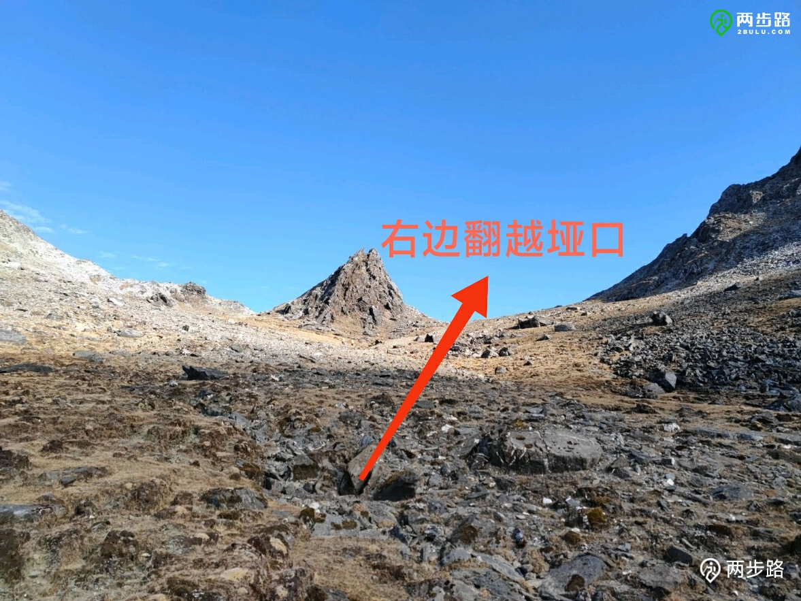

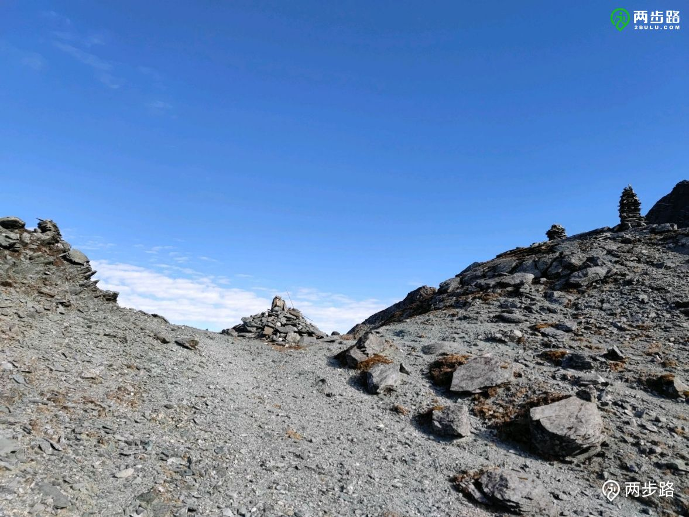

#### 小黄海

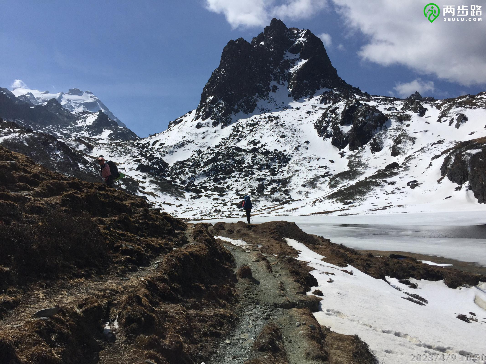s

#### 哈巴登山大本营

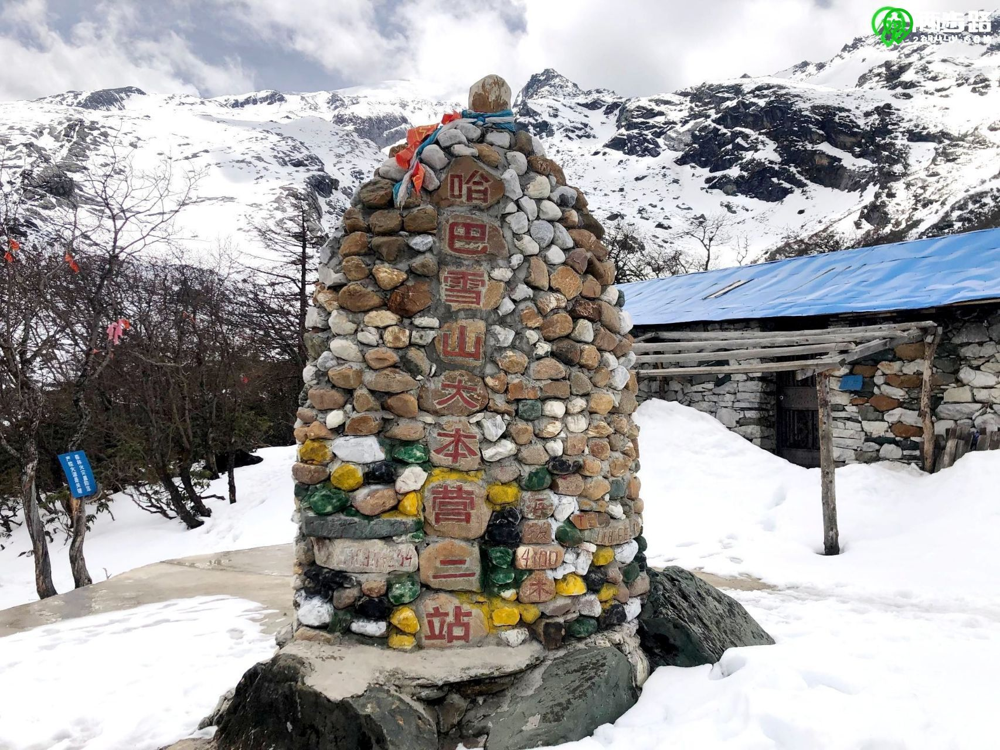

#### 黑海

#### 夫妻湖

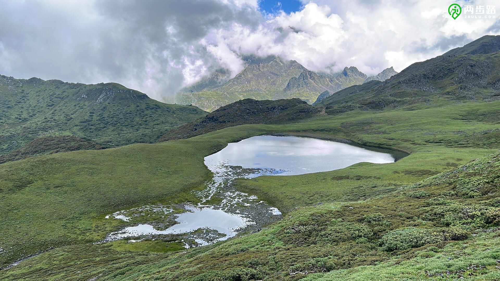